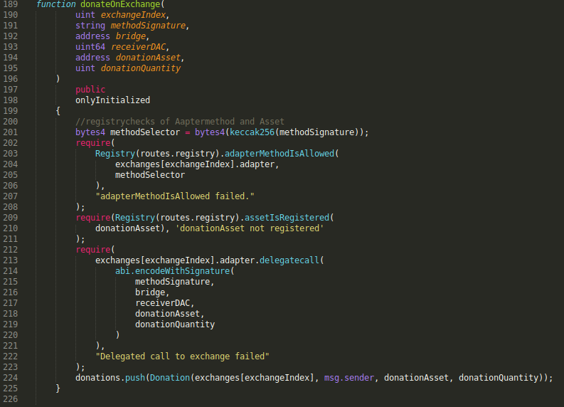
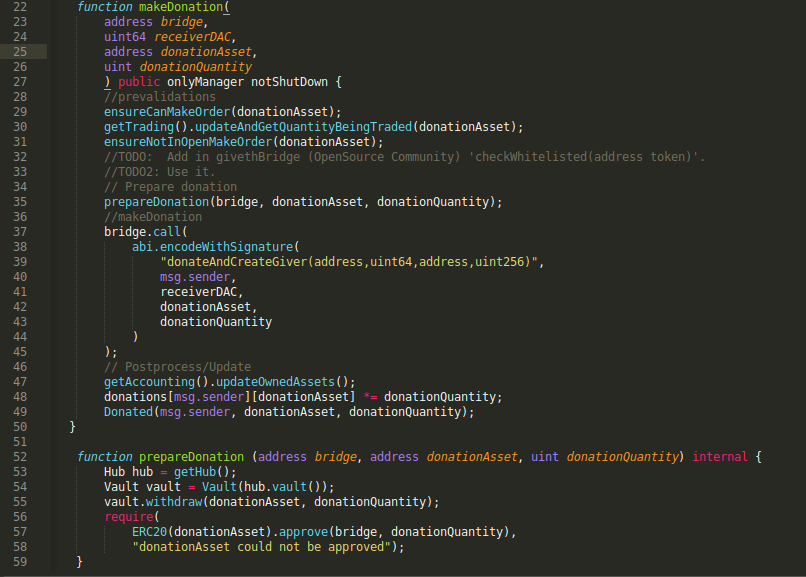
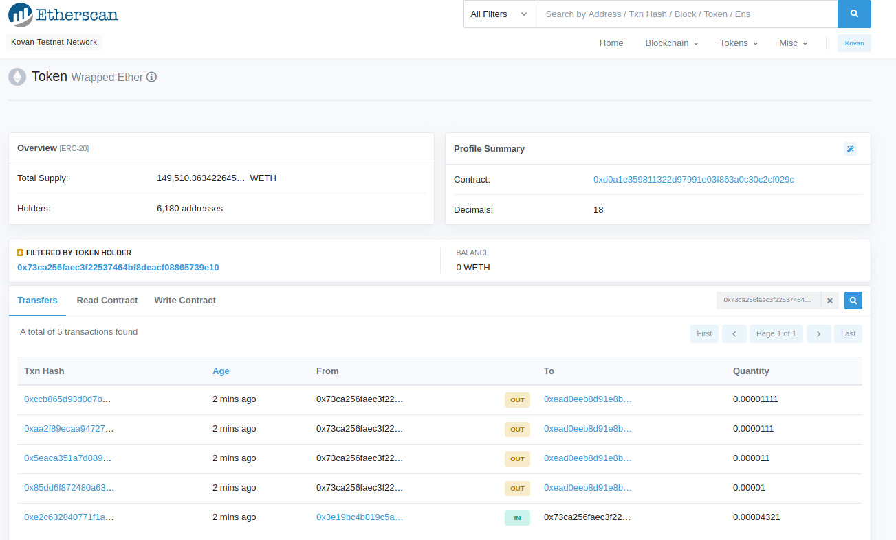
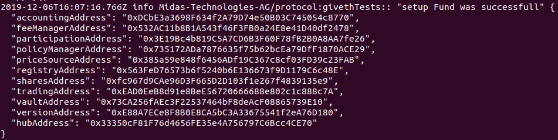

= givethModule
Willie Laubenheimer, <willie@m1d4s.tech>
:toc:

Report about the giveth Module from Midas Technologies AG for the @melonproject/protocol on the `kovan-donateOnE` https://github.com/Midas-Technologies-AG/protocol/tree/kovan-donateOnE[(link)]branch of @Midas-Technologies-AG/protocol forked from @melonproject.

<<<

== Introduction
////
Versioning 0. stands for `not on mainnet`, 0.1 means `live on testnet` and last for `chainID` (kovan=42 here). first time to get into the system and find a proper way to integrate this donation Module.
////

Overall the protocol enables fundmanagementsystems of ERC20 tokens on the Ethereum Mainchain (chainID=1, see https://www.ethereum.org/[https://www.ethereum.org/]) with a lot of adjustable policies.

The aim was to enable donations from a fund of the protocol to a giveth DAC (DecentralizedAltruisticCommunity see more on https://giveth.io[https://giveth.io]).

We needed to figure/test out our own way to connect those two decentralized Applications (dApp's), because the systems are on completely different Networks, except Mainnet.

<<<

== givethModule@protocol Setup

Finally we got it working on kovan testnet with an own deployed givethBridgeDUMMY.

To keep it simple lets speak about two layers in the protocol.

- solidity files (smartContracts)
- typescript files (to speak/use smartContracts)

=== SmartContracts

The first and heart layer is the whole smartContract system setup.

- Here we added in `Trading.sol` the function `donateOnExchange` to stay with the syntax and philosophy of `callOnExchange` but since its not a usual callOnExchange (usually the funds are trading their assets via this function), rather than an unusual donation, we created this new function. Because we aint getting assets back, we thought of this new setup as a better method.
`donateOnExchange` is for now a little bit too close to a givethDonation, but since we didn't know if this gets adopted and it is just the first showcase, we didn't implent it as open as callOnExchange. To open up the codeBase for other exchangeDonations would be one TODO for the future.
- This `donateOnExchange` function calls, as well as the `callOnExchange` setup calls the given ExchangeAdapter, the `givethBridgeAdapter.sol` especially the `makeDonation` function which takes a `uint receiverDAC`, `address token` and `uint amount` as inputs. `makeDonation` then checks if the whished asset can be traded/donated and takes it from the `Vault.sol` contract of the fund to call afterwards the givethBridge Contract and executes there `donateAndCreateGiver`. Now the donation is where it should be :) This ExchangeAdapter is maybe improvable through a new function in the `givethBridge.sol` which shows the whitelisted Tokens. This must be integrated by giveth...(TODO)

=== Typescript workaround

To use the smart contracts on ethereum one need a way to talk to the blockchain and get infos, execute functions, ec. Therefore were a lot of changes and adjustments necessary. These are the most important ones:

- Add the Exchange Adapter and the "Exchange" into the deployment process in `/src/utils/deploy/` `deploySystem.ts` and `deployThirdParty.ts`.
- write new typescript funtions to use the new adapter and prepare the args, set guards ec. (`/src/contracts/fund/trading/transactions/` `donateOnExchange.ts` and `donateGiveth.ts`)

In detail there are a lot more scripts u need to add different things. For this report this is way too deep, maybe we will write something like a tutorial or experience report, where everything will be explained in detail.

NOTE: As a proof of concept this Module is for now just on the kovan testnetwork. The code is @Midas-Technologies-AG/protocol a fork from @melonproject and especially the setup and following test commands from the Branch `kovan-donateOnE`.

<<<

== added .sol functions

The path of our added Exchange Adapter is `src/contracts/exchanges/adapters/givethBridgeAdapter.sol`. `.sol` files mostly have a `./transactions`, `./calls` directory with all the possible, or needed typescript functions the node app can execute.

Finally we added one function in `/src/contracts/fund/trading/Trading.sol` which then uses the Exchange Adapter we also added, the `givethBridgeAdapter.sol` in the path above.

There is one special way, the funds can be taken out of the `vault.sol`  and that is through adapters of the exchanges, which are so called `thirdParties`. So the adapter is the Accessor to the melonfundmanagementsystem. This module of the @melonproject/protocol adds a oneway donation function for funds.

So if you have an invested fund all you need to do is `import { donateGiveth } from ...` and use it like `await donateGiveth(environment, receiverDAC, token, amount);` to donate the `receiverDAC`(givethDAC on mainnet is 5), the `amount` of `token`.

.wWhat happens there?

The fundOwner must be able to call `tradingAddress.donateOnExchange()` and give the right inputs:
- exchangeIndex
- bridgeAddress
- receiverDAC
- token
- amount

which then calls `givethBridgeAdapter.makeDonation(...)` which then takes `amount` of `token` from the `vaultAddress.withdraw()`, `ERC20(token).approve()` the bridgeAddress for `token` and `amount`, and then call `givethBridge.donateAndCreateGiver()` which makes the donation finally.

<<<

== Kovan prototype:

Since this is about connecting two different independet systems, the @melonproject/protocol code hosted on github and @giveth especially their Bridge Contract, with the aim to donate from a fund from the melon system to a DAC of giveth, there are a few steps need to be done, before a convenient deploy on mainnet makes the benefit of this Module.

1. Further and deeper integration into the policy system ec. of the melonprotocol. (@melonproject?)
2. Redeploy of GivethBridge with ` checkWhitelisted(address _token) public view... `  (@giveth?)

For now the Setup is an own deployed GivethBridge which is taken from etherscan verified contract of the givethBridge on Ropsten/rechecked on github. But because we want to donate tokens  every token needs a whitelisting on giveth to be accepted as donation we deployed it ourselves to be able to set the whitlistings.

This Report is on kovan because of different reasons, usability(for developer), the much bigger and complexer solidity system is the protocol and its components as well as the support in the past have been much bigger on the kovan TESTNET chain. Although it should make no difference to use the MAINNET chain, there is a huge difference regarding, "real" costs of transactions, support also and a lot of developer probs because redeploying such a huge system as the melonprotocol maybe even with all from scratch could be depending on the very very high MAINNETvariance of the average GASPRICE be jumping between 1-2to5-30or everything else, since this is on Ethereum.

During this writing we deployed everything from scratch on kovan TESTNET and you will find the commands with output below, if you need to see or if you are interested :)

On the picture above and the following link you see 8 transactions starting at Block 15,279,692 with tx hash `0x2252970f9...` (https://kovan.etherscan.io/address/0x173add8c7e4f7034e9ca41c5d2d8a0a986fd427e[link]). These are donations from a fund ('Fund1') to the givethDAC matching the identifier `receiverDAC`. With the setting from the following commit on @Midas-Technologies-AG/protocol a fork from @melonproject/protocol, namely the branch `kovan-donateOnE` i run the two combined commands below to setup this testSetup from scratch with giving two export variables:
`PRIVATE_KEY=...` and `JSCON_RPC_ENDPOINT=wss://infura...`.

The created fund has following routes:

IMPORTANT: If you want to redo, set the  variables above via bash `export PRIV....` AND! change in the `bin/*deploy*.sh` file which gets called via `yarn dplK` via `package.json` command by removing line `--keystore` and adding `-P <your-private-key> \` or your personal keystore file.

<<<

== logs

.1 cmd: `yarn dplK && yarn test:system`

=== Output deploy:

[source,bash]
----
yarn run v1.17.3
$ sh bin/testDeployKovan.sh
$ node bin/melon.js deploy -T kyberPrice --config deployments/configs/test/kovan2.json --gas-price 2000000000 --keystore .keystore-midasAG.json --endpoint wss://kovan.infura.io/ws/v3/480f2e57242a4340aa21a94a9181f891
Deploying thirdParty & melon contracts.
Loaded config from ../deployments/configs/test/kovan2.json
Keystore file at: .keystore-midasAG.json
Using KEYSTORE_PASSWORD from env vars
2019-12-06T17:37:10.668Z info melon:protocol:utils:deploySystem: "Deploying system from:" "0x173Add8c7E4f7034e9ca41c5D2D8a0A986FD427E"
2019-12-06T17:37:11.291Z info melon:protocol:utils:deploySystem: "Not Deploying" "adapters.ethfinexAdapter"
2019-12-06T17:37:11.292Z info melon:protocol:utils:deploySystem: "Not Deploying" "adapters.kyberAdapter"
2019-12-06T17:37:11.293Z info melon:protocol:utils:deploySystem: "Not Deploying" "adapters.matchingMarketAdapter"
2019-12-06T17:37:11.293Z info melon:protocol:utils:deploySystem: "Not Deploying" "adapters.matchingMarketAccessor"
2019-12-06T17:37:11.293Z info melon:protocol:utils:deploySystem: "Not Deploying" "adapters.zeroExAdapter"
2019-12-06T17:37:11.294Z info melon:protocol:utils:deploySystem: "Not Deploying" "adapters.engineAdapter"
2019-12-06T17:37:11.294Z info melon:protocol:utils:deploySystem: "Not Deploying" "adapters.givethBridgeAdapter"
2019-12-06T17:37:11.294Z info melon:protocol:utils:deploySystem: "Not Deploying" "policies.priceTolerance"
2019-12-06T17:37:11.294Z info melon:protocol:utils:deploySystem: "Deploying" "policies.userWhitelist"
Node has 100 peers
2019-12-06T17:37:20.584Z info melon:protocol:utils:solidity:deploy: "Got receipt for:" "UserWhitelist(0x173Add8c7E4f7034e9ca41c5D2D8a0A986FD427E)" "at contract address:" "0xbaFAB38dF2EE81Caf976ca7Bb995C2e7A3D6E5C7" "transaction hash:" "0x2f1975e2f7852e1e24a5f8fd950a88c6751e967497323f663dcc90051626a3f2"
2019-12-06T17:37:20.589Z info melon:protocol:utils:deploySystem: "Not Deploying" "fees.managementFee"
2019-12-06T17:37:20.589Z info melon:protocol:utils:deploySystem: "Not Deploying" "fees.performanceFee"
2019-12-06T17:37:20.590Z info melon:protocol:utils:deploySystem: "Not Deploying" "factories.accountingFactory"
2019-12-06T17:37:20.590Z info melon:protocol:utils:deploySystem: "Not Deploying" "factories.feeManagerFactory"
2019-12-06T17:37:20.590Z info melon:protocol:utils:deploySystem: "Not Deploying" "factories.participationFactory"
2019-12-06T17:37:20.593Z info melon:protocol:utils:deploySystem: "Not Deploying" "factories.policyManagerFactory"
2019-12-06T17:37:20.595Z info melon:protocol:utils:deploySystem: "Not Deploying" "factories.sharesFactory"
2019-12-06T17:37:20.597Z info melon:protocol:utils:deploySystem: "Deploying" "factories.tradingFactory"
2019-12-06T17:37:24.624Z info melon:protocol:utils:solidity:deploy: "Got receipt for:" "TradingFactory()" "at contract address:" "0xAf476a1De3062bCbe5C75815514e18c85F5C5877" "transaction hash:" "0xdb8642b0c4d725ee18e5cb57a8fa120bb6bbe616b91e2a7332f6452da7d70dc8"
2019-12-06T17:37:24.626Z info melon:protocol:utils:deploySystem: "Not Deploying" "factories.vaultFactory"
2019-12-06T17:37:24.629Z info melon:protocol:utils:deploySystem: "Deploying" "registry"
2019-12-06T17:37:28.555Z info melon:protocol:utils:solidity:deploy: "Got receipt for:" "Registry(0x173Add8c7E4f7034e9ca41c5D2D8a0A986FD427E)" "at contract address:" "0x01C6C207087F0f0163a52bd6E71FA51Bd95bf167" "transaction hash:" "0x7fa9213594683d60ca98c08beababd697db361cad88ee5011ff6d49d49c42636"
2019-12-06T17:37:28.556Z info melon:protocol:utils:deploySystem: "Deploying" "engine"
2019-12-06T17:37:32.303Z info melon:protocol:utils:solidity:deploy: "Got receipt for:" "Engine(2592000,0x01C6C207087F0f0163a52bd6E71FA51Bd95bf167)" "at contract address:" "0x0607AC96CD050A0BD2B0940F3F9659610fea49d6" "transaction hash:" "0x551abc087414cb286d62b92fc4a9939b3a87b7ef09057fb169492bd900b99780"
2019-12-06T17:37:32.306Z info melon:protocol:utils:deploySystem: "Not Deploying" "priceSource"
2019-12-06T17:37:32.307Z info melon:protocol:utils:deploySystem: "Register priceSource"
2019-12-06T17:37:32.310Z info melon:protocol:utils:solidity:transactionFactory: "Prepare transaction" "Registry@0x01C6C207087F0f0163a52bd6E71FA51Bd95bf167.setPriceSource(\"0x385a59e848f6456ADf19C367c8cf03FD39c23FAB\")"
2019-12-06T17:37:36.498Z info melon:protocol:utils:solidity:callFactory: "Prepare call" "Registry@0x01C6C207087F0f0163a52bd6E71FA51Bd95bf167.engine()"
2019-12-06T17:37:37.527Z info melon:protocol:utils:deploySystem: "Setting native token"
2019-12-06T17:37:37.527Z info melon:protocol:utils:solidity:transactionFactory: "Prepare transaction" "Registry@0x01C6C207087F0f0163a52bd6E71FA51Bd95bf167.setNativeAsset(\"0xd0a1e359811322d97991e03f863a0c30c2cf029c\")"
2019-12-06T17:37:40.500Z info melon:protocol:utils:deploySystem: "Setting MLN token"
2019-12-06T17:37:40.501Z info melon:protocol:utils:solidity:transactionFactory: "Prepare transaction" "Registry@0x01C6C207087F0f0163a52bd6E71FA51Bd95bf167.setMlnToken(\"0x2C2edf394638931eb672BD9261d2AA1934874d45\")"
2019-12-06T17:37:44.677Z info melon:protocol:utils:deploySystem: "Setting engine on registry"
2019-12-06T17:37:44.678Z info melon:protocol:utils:solidity:transactionFactory: "Prepare transaction" "Registry@0x01C6C207087F0f0163a52bd6E71FA51Bd95bf167.setEngine(\"0x0607AC96CD050A0BD2B0940F3F9659610fea49d6\")"
2019-12-06T17:37:52.650Z info melon:protocol:utils:deploySystem: "Setting MGM on registry"
2019-12-06T17:37:52.652Z info melon:protocol:utils:solidity:transactionFactory: "Prepare transaction" "Registry@0x01C6C207087F0f0163a52bd6E71FA51Bd95bf167.setMGM(\"0x173Add8c7E4f7034e9ca41c5D2D8a0A986FD427E\")"
2019-12-06T17:37:56.579Z info melon:protocol:utils:deploySystem: "Setting ethfinex wrapper registry"
2019-12-06T17:37:56.580Z info melon:protocol:utils:solidity:transactionFactory: "Prepare transaction" "Registry@0x01C6C207087F0f0163a52bd6E71FA51Bd95bf167.setEthfinexWrapperRegistry(\"0x0c722EA3b6f05d109712dFBfa4421e6b7c5254b9\")"
2019-12-06T17:38:04.452Z info melon:protocol:utils:solidity:callFactory: "Prepare call" "Registry@0x01C6C207087F0f0163a52bd6E71FA51Bd95bf167.isFeeRegistered(0xE9D49808967d574f7Aec6A5Fe11766D01819C6C7)"
2019-12-06T17:38:04.597Z info melon:protocol:utils:solidity:callFactory: "Prepare call" "Registry@0x01C6C207087F0f0163a52bd6E71FA51Bd95bf167.isFeeRegistered(0xBB7E55A9199191501dbfbc68862F5e93bC370827)"
2019-12-06T17:38:04.762Z info melon:protocol:utils:deploySystem: "Registering fees"
2019-12-06T17:38:04.763Z info melon:protocol:utils:solidity:transactionFactory: "Prepare transaction" "Registry@0x01C6C207087F0f0163a52bd6E71FA51Bd95bf167.registerFees([\"0xE9D49808967d574f7Aec6A5Fe11766D01819C6C7\",\"0xBB7E55A9199191501dbfbc68862F5e93bC370827\"])"
2019-12-06T17:38:08.606Z info melon:protocol:utils:deploySystem: "Deploying" "ranking"
2019-12-06T17:38:12.652Z info melon:protocol:utils:solidity:deploy: "Got receipt for:" "FundRanking()" "at contract address:" "0xd4A4c61761c3c9Ae519B7197fAD5c821A11E0e33" "transaction hash:" "0xff4a40544d6d25aa5026c1d0249704538c95c79226d6abf60dfa3fd3f2b43e24"
2019-12-06T17:38:12.656Z info melon:protocol:utils:deploySystem: "Deploying" "version"
2019-12-06T17:38:16.665Z info melon:protocol:utils:solidity:deploy: "Got receipt for:" "Version(0x85D7577839303551c3f3B083754f43e0531feA8a,0xFd0F29EfbF33D2826c35D1977125d4ed7980E809,0x3bA196e5882ee5847a21b6015bA322A8e2Ff3a75,0x91d84c092180274b20f5d909D385BF2758985eC1,0xAf476a1De3062bCbe5C75815514e18c85F5C5877,0xf2879E95a4F0A88d244Aef11137e767F4E80b4bF,0xE3194a85bC6F3c010384A7cbA80Abc54F07C30C5,0x01C6C207087F0f0163a52bd6E71FA51Bd95bf167,0x173Add8c7E4f7034e9ca41c5D2D8a0A986FD427E)" "at contract address:" "0x6917f78D84545F4eEcaf62b27f519C6dBB9Fa093" "transaction hash:" "0x49890d97f55889779069db0319566fcc261429645694652e5d20f2761cd0c90c"
2019-12-06T17:38:16.669Z info melon:protocol:utils:solidity:transactionFactory: "Prepare transaction" "Registry@0x01C6C207087F0f0163a52bd6E71FA51Bd95bf167.setMGM(\"0x173Add8c7E4f7034e9ca41c5D2D8a0A986FD427E\")"
2019-12-06T17:38:20.323Z info melon:protocol:utils:solidity:callFactory: "Prepare call" "AmguConsumer@0x6917f78D84545F4eEcaf62b27f519C6dBB9Fa093.mlnToken()"
2019-12-06T17:38:20.454Z info melon:protocol:utils:solidity:callFactory: "Prepare call" "PreminedToken@0x2C2edf394638931eb672BD9261d2AA1934874d45.totalSupply()"
2019-12-06T17:38:20.590Z info melon:protocol:utils:solidity:transactionFactory: "Prepare transaction" "Engine@0x0607AC96CD050A0BD2B0940F3F9659610fea49d6.setAmguPrice(\"0\")"
2019-12-06T17:38:24.531Z info melon:protocol:utils:solidity:callFactory: "Prepare call" "Engine@0x0607AC96CD050A0BD2B0940F3F9659610fea49d6.getAmguPrice()"
2019-12-06T17:38:24.673Z info melon:protocol:utils:solidity:callFactory: "Prepare call" "AmguConsumer@0x0607AC96CD050A0BD2B0940F3F9659610fea49d6.mlnToken()"
2019-12-06T17:38:24.803Z info melon:protocol:utils:solidity:callFactory: "Prepare call" "PreminedToken@0x2C2edf394638931eb672BD9261d2AA1934874d45.totalSupply()"
2019-12-06T17:38:24.928Z info melon:protocol:utils:solidity:transactionFactory: "Prepare transaction" "Registry@0x01C6C207087F0f0163a52bd6E71FA51Bd95bf167.setMGM(\"0x173Add8c7E4f7034e9ca41c5D2D8a0A986FD427E\")"
2019-12-06T17:38:28.527Z info melon:protocol:utils:solidity:callFactory: "Prepare call" "Registry@0x01C6C207087F0f0163a52bd6E71FA51Bd95bf167.engine()"
2019-12-06T17:38:28.801Z info melon:protocol:utils:solidity:callFactory: "Prepare call" "PreminedToken@0x2C2edf394638931eb672BD9261d2AA1934874d45.totalSupply()"
2019-12-06T17:38:29.056Z info melon:protocol:utils:solidity:callFactory: "Prepare call" "PreminedToken@0xd0A1E359811322d97991E03f863a0C30C2cF029C.totalSupply()"
2019-12-06T17:38:29.824Z info melon:protocol:utils:solidity:callFactory: "Prepare call" "Registry@0x01C6C207087F0f0163a52bd6E71FA51Bd95bf167.versionInformation(0x6917f78D84545F4eEcaf62b27f519C6dBB9Fa093)"
2019-12-06T17:38:29.960Z info melon:protocol:utils:solidity:transactionFactory: "Prepare transaction" "Registry@0x01C6C207087F0f0163a52bd6E71FA51Bd95bf167.registerVersion(\"0x6917f78D84545F4eEcaf62b27f519C6dBB9Fa093\",\"0x000000000000000000000000000000000000000000000000000000312e302e30\")"
2019-12-06T17:38:32.628Z info melon:protocol:utils:solidity:transactionFactory: "Prepare transaction" "Registry@0x01C6C207087F0f0163a52bd6E71FA51Bd95bf167.registerExchangeAdapter(\"0xbED692938E714Da2a1d5407E5D99658F7D4c8079\",\"0xA27CB53BdBbb12d21E8e28aa84e2486c52A89663\",true,[\"0x79705be7\",\"0xe51be6e8\",\"0x61346679\",\"0x38c95122\",\"0x6b312d78\"])"
2019-12-06T17:38:36.458Z info melon:protocol:utils:solidity:transactionFactory: "Prepare transaction" "Registry@0x01C6C207087F0f0163a52bd6E71FA51Bd95bf167.registerExchangeAdapter(\"0x692f391bCc85cefCe8C237C01e1f636BbD70EA4D\",\"0xA1A4aD89C376Cab1731d06b4680B13d3B9340278\",false,[\"0x79705be7\",\"0xe51be6e8\",\"0x61346679\",\"0x38c95122\",\"0x6b312d78\"])"
2019-12-06T17:38:44.488Z info melon:protocol:utils:solidity:transactionFactory: "Prepare transaction" "Registry@0x01C6C207087F0f0163a52bd6E71FA51Bd95bf167.registerExchangeAdapter(\"0x35dd2932454449b14cee11a94d3674a936d5d7b2\",\"0xA28e3301222B9cb9C54910F0620Fbf92bbE38be3\",false,[\"0x79705be7\",\"0xe51be6e8\",\"0x61346679\",\"0x38c95122\",\"0x6b312d78\"])"
2019-12-06T17:38:48.568Z info melon:protocol:utils:solidity:transactionFactory: "Prepare transaction" "Registry@0x01C6C207087F0f0163a52bd6E71FA51Bd95bf167.registerExchangeAdapter(\"0x77ac83FaA57974CDb6f7a130DF50de3fe0792673\",\"0xB79133a2c7905F035ae237326EFACfE0BB00DC90\",true,[\"0x79705be7\",\"0xe51be6e8\",\"0x61346679\",\"0x38c95122\",\"0x6b312d78\"])"
2019-12-06T17:38:52.280Z info melon:protocol:utils:solidity:transactionFactory: "Prepare transaction" "Registry@0x01C6C207087F0f0163a52bd6E71FA51Bd95bf167.registerExchangeAdapter(\"0x0607AC96CD050A0BD2B0940F3F9659610fea49d6\",\"0x24289D3dee1c6eA31bEe75d8A7Dd6a36E29F26c6\",false,[\"0x79705be7\",\"0xe51be6e8\",\"0x61346679\",\"0x38c95122\",\"0x6b312d78\"])"
2019-12-06T17:38:56.618Z info melon:protocol:utils:solidity:transactionFactory: "Prepare transaction" "Registry@0x01C6C207087F0f0163a52bd6E71FA51Bd95bf167.registerExchangeAdapter(\"0x07161Bf9907b598988a84Ac37fBa71F5b1548fD0\",\"0xF4fE10d2086380010E81b4120244067c6EF6070e\",false,[\"0x79705be7\",\"0xe51be6e8\",\"0x61346679\",\"0x38c95122\",\"0x6b312d78\"])"
2019-12-06T17:39:00.547Z info melon:protocol:utils:solidity:transactionFactory: "Prepare transaction" "Registry@0x01C6C207087F0f0163a52bd6E71FA51Bd95bf167.registerAsset(\"0xB14c0f4a8150c028806bE46Afb5214daea870CB7\",\"\",\"BAT\",\"\",\"0\",[],[])"
2019-12-06T17:39:04.484Z info melon:protocol:utils:solidity:transactionFactory: "Prepare transaction" "Registry@0x01C6C207087F0f0163a52bd6E71FA51Bd95bf167.registerAsset(\"0x16886a2B35BF40C59087500dEC9Bbc24765382C2\",\"\",\"DGX\",\"\",\"0\",[],[])"
2019-12-06T17:39:08.354Z info melon:protocol:utils:solidity:transactionFactory: "Prepare transaction" "Registry@0x01C6C207087F0f0163a52bd6E71FA51Bd95bf167.registerAsset(\"0xa80C98433E2a82DF3636ED934083E3285163Fad8\",\"\",\"REP\",\"\",\"0\",[],[])"
2019-12-06T17:39:12.497Z info melon:protocol:utils:solidity:transactionFactory: "Prepare transaction" "Registry@0x01C6C207087F0f0163a52bd6E71FA51Bd95bf167.registerAsset(\"0x0A3610a0E87cEDDEE6b81b62b462c7a0fD450E2a\",\"\",\"ZRX\",\"\",\"0\",[],[])"
2019-12-06T17:39:16.577Z info melon:protocol:utils:solidity:transactionFactory: "Prepare transaction" "Registry@0x01C6C207087F0f0163a52bd6E71FA51Bd95bf167.registerAsset(\"0xd0a1e359811322d97991e03f863a0c30c2cf029c\",\"\",\"WETH\",\"\",\"0\",[],[])"
2019-12-06T17:39:20.494Z info melon:protocol:utils:solidity:transactionFactory: "Prepare transaction" "Registry@0x01C6C207087F0f0163a52bd6E71FA51Bd95bf167.registerAsset(\"0x2C2edf394638931eb672BD9261d2AA1934874d45\",\"\",\"MLN\",\"\",\"0\",[],[])"
2019-12-06T17:39:24.363Z info melon:protocol:utils:solidity:transactionFactory: "Prepare transaction" "Registry@0x01C6C207087F0f0163a52bd6E71FA51Bd95bf167.registerAsset(\"0xbdaD7a926A7E70C6B0AF367d97D992b904BBAFcf\",\"\",\"MKR\",\"\",\"0\",[],[])"
2019-12-06T17:39:28.529Z info melon:protocol:utils:solidity:transactionFactory: "Prepare transaction" "Registry@0x01C6C207087F0f0163a52bd6E71FA51Bd95bf167.registerAsset(\"0x1D3bC44DD6C3F00640A6825B48F1C78770fd21d8\",\"\",\"DAI\",\"\",\"0\",[],[])"
2019-12-06T17:39:32.625Z info melon:protocol:utils:solidity:transactionFactory: "Prepare transaction" "Registry@0x01C6C207087F0f0163a52bd6E71FA51Bd95bf167.registerAsset(\"0xB5098BAFbF90F278374EcFA973A703fD0eb87A12\",\"\",\"KNC\",\"\",\"0\",[],[])"
2019-12-06T17:39:40.455Z info melon:protocol:utils:deploySystem: "Deployed:" "42:kyberPrice"
Done in 151.61s.
----

<<<

=== Output createFund and test giveth donations.

[source,bash]
----
yarn run v1.17.3
$ yarn pretest && yarn jest --config ./src/tests/system/jest.config.js --runInBand --forceExit
$ rimraf logs/test-*.log
$ /home/willie/github/midas/protocol/node_modules/.bin/jest --config ./src/tests/system/jest.config.js --runInBand --forceExit
● Deprecation Warning:

  Option "setupTestFrameworkScriptFile" was replaced by configuration "setupFilesAfterEnv", which supports multiple paths.

  Please update your configuration.

  Configuration Documentation:
  https://jestjs.io/docs/configuration.html

ts-jest[versions] (WARN) Version 24.1.0 of jest installed has not been tested with ts-jest. If you're experiencing issues, consider using a supported version (>=22.0.0 <24.0.0). Please do not report issues in ts-jest if you are using unsupported versions.
2019-12-06T17:39:56.713Z info Midas-Technologies-AG/protocol:test-givethBridge:init: "Loaded deployment from:" "deployments/kovan-kyberPrice.json"
2019-12-06T17:39:56.850Z info Midas-Technologies-AG/protocol:test-givethBridge:init: "Prepared Web3 with:" "0x173Add8c7E4f7034e9ca41c5D2D8a0A986FD427E"
2019-12-06T17:39:56.850Z info Midas-Technologies-AG/protocol:test-givethBridge:init: "Prepared wallet."
2019-12-06T17:39:56.851Z info Midas-Technologies-AG/protocol:test-givethBridge:init: "Created wallet."
2019-12-06T17:39:56.851Z info Midas-Technologies-AG/protocol:test-givethBridge:init: "Construct Environment was successfull for:" "0x173Add8c7E4f7034e9ca41c5D2D8a0A986FD427E"
2019-12-06T17:39:56.851Z info Midas-Technologies-AG/protocol:test-givethModule:: "Created environment and init testLogger."
2019-12-06T17:39:56.858Z info melon:protocol:utils:solidity:callFactory: "Prepare call" "PreminedToken@0xd0a1e359811322d97991e03f863a0c30c2cf029c.balanceOf(0x173Add8c7E4f7034e9ca41c5D2D8a0A986FD427E)"
2019-12-06T17:39:57.739Z info melon:protocol:utils:solidity:callFactory: "Prepare call" "PreminedToken@0xd0a1e359811322d97991e03f863a0c30c2cf029c.totalSupply()"
2019-12-06T17:39:57.871Z info melon:protocol:utils:solidity:transactionFactory: "Prepare transaction" "StandardToken@0xd0a1e359811322d97991e03f863a0c30c2cf029c.transfer(\"0xF4fE10d2086380010E81b4120244067c6EF6070e\",\"500000000000000000\")"
2019-12-06T17:40:00.439Z info Midas-Technologies-AG/protocol:givethTests:: "start donateGivethAdapter..."
2019-12-06T17:40:00.442Z info melon:protocol:utils:solidity:transactionFactory: "Prepare transaction" "GivethBridgeAdapter@0xF4fE10d2086380010E81b4120244067c6EF6070e.donateViaGivethBridge(\"0x07161Bf9907b598988a84Ac37fBa71F5b1548fD0\",5,\"0xd0a1e359811322d97991e03f863a0c30c2cf029c\",\"500000000000000000\")"
2019-12-06T17:40:04.486Z info Midas-Technologies-AG/protocol:givethTests:: "Donated token" "WETH" true
2019-12-06T17:40:04.487Z info Midas-Technologies-AG/protocol:test-givethModule:: "Donated Asset from" "0x173Add8c7E4f7034e9ca41c5D2D8a0A986FD427E"
2019-12-06T17:40:04.492Z info melon:protocol:utils:solidity:transactionFactory: "Prepare transaction" "FundFactory@0x6917f78D84545F4eEcaf62b27f519C6dBB9Fa093.beginSetup(\"0x173Add8c7E4f7034e9ca41c5D2D8a0A986FD427E\",\"0x00000000000000000000000000000000000000000000000000000046756e6431\",[\"0xe9d49808967d574f7aec6a5fe11766d01819c6c7\",\"0xbb7e55a9199191501dbfbc68862f5e93bc370827\"],[\"2000000000000000\",\"20000000000000000\"],[\"3888000\",\"7776000\"],[\"0xbED692938E714Da2a1d5407E5D99658F7D4c8079\",\"0x692f391bCc85cefCe8C237C01e1f636BbD70EA4D\",\"0x35dd2932454449b14cee11a94d3674a936d5d7b2\",\"0x77ac83FaA57974CDb6f7a130DF50de3fe0792673\",\"0x0607AC96CD050A0BD2B0940F3F9659610fea49d6\",\"0x07161Bf9907b598988a84Ac37fBa71F5b1548fD0\"],[\"0xA27CB53BdBbb12d21E8e28aa84e2486c52A89663\",\"0xA1A4aD89C376Cab1731d06b4680B13d3B9340278\",\"0xA28e3301222B9cb9C54910F0620Fbf92bbE38be3\",\"0xB79133a2c7905F035ae237326EFACfE0BB00DC90\",\"0x24289D3dee1c6eA31bEe75d8A7Dd6a36E29F26c6\",\"0xF4fE10d2086380010E81b4120244067c6EF6070e\"],\"0xd0a1e359811322d97991e03f863a0c30c2cf029c\",[\"0xd0a1e359811322d97991e03f863a0c30c2cf029c\",\"0x2C2edf394638931eb672BD9261d2AA1934874d45\"])"
2019-12-06T17:40:12.560Z info melon:protocol:utils:solidity:transactionFactory: "Prepare transaction" "FundFactory@0x6917f78D84545F4eEcaf62b27f519C6dBB9Fa093.createAccounting()"
2019-12-06T17:40:16.491Z info melon:protocol:utils:solidity:transactionFactory: "Prepare transaction" "FundFactory@0x6917f78D84545F4eEcaf62b27f519C6dBB9Fa093.createFeeManager()"
2019-12-06T17:40:16.828Z info melon:protocol:utils:solidity:callFactory: "Prepare call" "AmguConsumer@0x6917f78D84545F4eEcaf62b27f519C6dBB9Fa093.mlnToken()"
2019-12-06T17:40:16.975Z info melon:protocol:utils:solidity:callFactory: "Prepare call" "PreminedToken@0x2C2edf394638931eb672BD9261d2AA1934874d45.totalSupply()"
2019-12-06T17:40:17.108Z info melon:protocol:utils:solidity:callFactory: "Prepare call" "AmguConsumer@0x6917f78D84545F4eEcaf62b27f519C6dBB9Fa093.engine()"
2019-12-06T17:40:17.239Z info melon:protocol:utils:solidity:callFactory: "Prepare call" "AmguConsumer@0x6917f78D84545F4eEcaf62b27f519C6dBB9Fa093.priceSource()"
2019-12-06T17:40:17.366Z info melon:protocol:utils:solidity:callFactory: "Prepare call" "Engine@0x0607AC96CD050A0BD2B0940F3F9659610fea49d6.getAmguPrice()"
2019-12-06T17:40:17.588Z info melon:protocol:utils:solidity:callFactory: "Prepare call" "AmguConsumer@0x0607AC96CD050A0BD2B0940F3F9659610fea49d6.mlnToken()"
2019-12-06T17:40:17.713Z info melon:protocol:utils:solidity:callFactory: "Prepare call" "PreminedToken@0x2C2edf394638931eb672BD9261d2AA1934874d45.totalSupply()"
2019-12-06T17:40:17.972Z info melon:protocol:utils:solidity:callFactory: "Prepare call" "PreminedToken@0xd0A1E359811322d97991E03f863a0C30C2cF029C.totalSupply()"
2019-12-06T17:40:20.630Z info melon:protocol:utils:solidity:transactionFactory: "Prepare transaction" "FundFactory@0x6917f78D84545F4eEcaf62b27f519C6dBB9Fa093.createParticipation()"
2019-12-06T17:40:21.023Z info melon:protocol:utils:solidity:callFactory: "Prepare call" "AmguConsumer@0x6917f78D84545F4eEcaf62b27f519C6dBB9Fa093.mlnToken()"
2019-12-06T17:40:21.142Z info melon:protocol:utils:solidity:callFactory: "Prepare call" "PreminedToken@0x2C2edf394638931eb672BD9261d2AA1934874d45.totalSupply()"
2019-12-06T17:40:21.269Z info melon:protocol:utils:solidity:callFactory: "Prepare call" "AmguConsumer@0x6917f78D84545F4eEcaf62b27f519C6dBB9Fa093.engine()"
2019-12-06T17:40:21.410Z info melon:protocol:utils:solidity:callFactory: "Prepare call" "AmguConsumer@0x6917f78D84545F4eEcaf62b27f519C6dBB9Fa093.priceSource()"
2019-12-06T17:40:21.537Z info melon:protocol:utils:solidity:callFactory: "Prepare call" "Engine@0x0607AC96CD050A0BD2B0940F3F9659610fea49d6.getAmguPrice()"
2019-12-06T17:40:21.671Z info melon:protocol:utils:solidity:callFactory: "Prepare call" "AmguConsumer@0x0607AC96CD050A0BD2B0940F3F9659610fea49d6.mlnToken()"
2019-12-06T17:40:21.799Z info melon:protocol:utils:solidity:callFactory: "Prepare call" "PreminedToken@0x2C2edf394638931eb672BD9261d2AA1934874d45.totalSupply()"
2019-12-06T17:40:22.069Z info melon:protocol:utils:solidity:callFactory: "Prepare call" "PreminedToken@0xd0A1E359811322d97991E03f863a0C30C2cF029C.totalSupply()"
2019-12-06T17:40:28.331Z info melon:protocol:utils:solidity:transactionFactory: "Prepare transaction" "FundFactory@0x6917f78D84545F4eEcaf62b27f519C6dBB9Fa093.createPolicyManager()"
2019-12-06T17:40:28.658Z info melon:protocol:utils:solidity:callFactory: "Prepare call" "AmguConsumer@0x6917f78D84545F4eEcaf62b27f519C6dBB9Fa093.mlnToken()"
2019-12-06T17:40:28.795Z info melon:protocol:utils:solidity:callFactory: "Prepare call" "PreminedToken@0x2C2edf394638931eb672BD9261d2AA1934874d45.totalSupply()"
2019-12-06T17:40:28.918Z info melon:protocol:utils:solidity:callFactory: "Prepare call" "AmguConsumer@0x6917f78D84545F4eEcaf62b27f519C6dBB9Fa093.engine()"
2019-12-06T17:40:29.053Z info melon:protocol:utils:solidity:callFactory: "Prepare call" "AmguConsumer@0x6917f78D84545F4eEcaf62b27f519C6dBB9Fa093.priceSource()"
2019-12-06T17:40:29.194Z info melon:protocol:utils:solidity:callFactory: "Prepare call" "Engine@0x0607AC96CD050A0BD2B0940F3F9659610fea49d6.getAmguPrice()"
2019-12-06T17:40:29.325Z info melon:protocol:utils:solidity:callFactory: "Prepare call" "AmguConsumer@0x0607AC96CD050A0BD2B0940F3F9659610fea49d6.mlnToken()"
2019-12-06T17:40:29.447Z info melon:protocol:utils:solidity:callFactory: "Prepare call" "PreminedToken@0x2C2edf394638931eb672BD9261d2AA1934874d45.totalSupply()"
2019-12-06T17:40:29.705Z info melon:protocol:utils:solidity:callFactory: "Prepare call" "PreminedToken@0xd0A1E359811322d97991E03f863a0C30C2cF029C.totalSupply()"
2019-12-06T17:40:32.526Z info melon:protocol:utils:solidity:transactionFactory: "Prepare transaction" "FundFactory@0x6917f78D84545F4eEcaf62b27f519C6dBB9Fa093.createShares()"
2019-12-06T17:40:32.900Z info melon:protocol:utils:solidity:callFactory: "Prepare call" "AmguConsumer@0x6917f78D84545F4eEcaf62b27f519C6dBB9Fa093.mlnToken()"
2019-12-06T17:40:33.028Z info melon:protocol:utils:solidity:callFactory: "Prepare call" "PreminedToken@0x2C2edf394638931eb672BD9261d2AA1934874d45.totalSupply()"
2019-12-06T17:40:33.277Z info melon:protocol:utils:solidity:callFactory: "Prepare call" "AmguConsumer@0x6917f78D84545F4eEcaf62b27f519C6dBB9Fa093.engine()"
2019-12-06T17:40:33.404Z info melon:protocol:utils:solidity:callFactory: "Prepare call" "AmguConsumer@0x6917f78D84545F4eEcaf62b27f519C6dBB9Fa093.priceSource()"
2019-12-06T17:40:33.523Z info melon:protocol:utils:solidity:callFactory: "Prepare call" "Engine@0x0607AC96CD050A0BD2B0940F3F9659610fea49d6.getAmguPrice()"
2019-12-06T17:40:33.657Z info melon:protocol:utils:solidity:callFactory: "Prepare call" "AmguConsumer@0x0607AC96CD050A0BD2B0940F3F9659610fea49d6.mlnToken()"
2019-12-06T17:40:33.782Z info melon:protocol:utils:solidity:callFactory: "Prepare call" "PreminedToken@0x2C2edf394638931eb672BD9261d2AA1934874d45.totalSupply()"
2019-12-06T17:40:34.031Z info melon:protocol:utils:solidity:callFactory: "Prepare call" "PreminedToken@0xd0A1E359811322d97991E03f863a0C30C2cF029C.totalSupply()"
2019-12-06T17:40:40.677Z info melon:protocol:utils:solidity:transactionFactory: "Prepare transaction" "FundFactory@0x6917f78D84545F4eEcaf62b27f519C6dBB9Fa093.createTrading()"
2019-12-06T17:40:41.015Z info melon:protocol:utils:solidity:callFactory: "Prepare call" "AmguConsumer@0x6917f78D84545F4eEcaf62b27f519C6dBB9Fa093.mlnToken()"
2019-12-06T17:40:41.150Z info melon:protocol:utils:solidity:callFactory: "Prepare call" "PreminedToken@0x2C2edf394638931eb672BD9261d2AA1934874d45.totalSupply()"
2019-12-06T17:40:41.284Z info melon:protocol:utils:solidity:callFactory: "Prepare call" "AmguConsumer@0x6917f78D84545F4eEcaf62b27f519C6dBB9Fa093.engine()"
2019-12-06T17:40:41.409Z info melon:protocol:utils:solidity:callFactory: "Prepare call" "AmguConsumer@0x6917f78D84545F4eEcaf62b27f519C6dBB9Fa093.priceSource()"
2019-12-06T17:40:41.546Z info melon:protocol:utils:solidity:callFactory: "Prepare call" "Engine@0x0607AC96CD050A0BD2B0940F3F9659610fea49d6.getAmguPrice()"
2019-12-06T17:40:41.680Z info melon:protocol:utils:solidity:callFactory: "Prepare call" "AmguConsumer@0x0607AC96CD050A0BD2B0940F3F9659610fea49d6.mlnToken()"
2019-12-06T17:40:41.804Z info melon:protocol:utils:solidity:callFactory: "Prepare call" "PreminedToken@0x2C2edf394638931eb672BD9261d2AA1934874d45.totalSupply()"
2019-12-06T17:40:42.059Z info melon:protocol:utils:solidity:callFactory: "Prepare call" "PreminedToken@0xd0A1E359811322d97991E03f863a0C30C2cF029C.totalSupply()"
2019-12-06T17:40:44.410Z info melon:protocol:utils:solidity:transactionFactory: "Prepare transaction" "FundFactory@0x6917f78D84545F4eEcaf62b27f519C6dBB9Fa093.createVault()"
2019-12-06T17:40:44.701Z info melon:protocol:utils:solidity:callFactory: "Prepare call" "AmguConsumer@0x6917f78D84545F4eEcaf62b27f519C6dBB9Fa093.mlnToken()"
2019-12-06T17:40:44.831Z info melon:protocol:utils:solidity:callFactory: "Prepare call" "PreminedToken@0x2C2edf394638931eb672BD9261d2AA1934874d45.totalSupply()"
2019-12-06T17:40:44.978Z info melon:protocol:utils:solidity:callFactory: "Prepare call" "AmguConsumer@0x6917f78D84545F4eEcaf62b27f519C6dBB9Fa093.engine()"
2019-12-06T17:40:45.127Z info melon:protocol:utils:solidity:callFactory: "Prepare call" "AmguConsumer@0x6917f78D84545F4eEcaf62b27f519C6dBB9Fa093.priceSource()"
2019-12-06T17:40:45.253Z info melon:protocol:utils:solidity:callFactory: "Prepare call" "Engine@0x0607AC96CD050A0BD2B0940F3F9659610fea49d6.getAmguPrice()"
2019-12-06T17:40:45.377Z info melon:protocol:utils:solidity:callFactory: "Prepare call" "AmguConsumer@0x0607AC96CD050A0BD2B0940F3F9659610fea49d6.mlnToken()"
2019-12-06T17:40:45.516Z info melon:protocol:utils:solidity:callFactory: "Prepare call" "PreminedToken@0x2C2edf394638931eb672BD9261d2AA1934874d45.totalSupply()"
2019-12-06T17:40:45.796Z info melon:protocol:utils:solidity:callFactory: "Prepare call" "PreminedToken@0xd0A1E359811322d97991E03f863a0C30C2cF029C.totalSupply()"
2019-12-06T17:40:48.666Z info melon:protocol:utils:solidity:transactionFactory: "Prepare transaction" "FundFactory@0x6917f78D84545F4eEcaf62b27f519C6dBB9Fa093.completeSetup()"
2019-12-06T17:40:49.036Z info melon:protocol:utils:solidity:callFactory: "Prepare call" "AmguConsumer@0x6917f78D84545F4eEcaf62b27f519C6dBB9Fa093.mlnToken()"
2019-12-06T17:40:49.160Z info melon:protocol:utils:solidity:callFactory: "Prepare call" "PreminedToken@0x2C2edf394638931eb672BD9261d2AA1934874d45.totalSupply()"
2019-12-06T17:40:49.303Z info melon:protocol:utils:solidity:callFactory: "Prepare call" "AmguConsumer@0x6917f78D84545F4eEcaf62b27f519C6dBB9Fa093.engine()"
2019-12-06T17:40:49.456Z info melon:protocol:utils:solidity:callFactory: "Prepare call" "AmguConsumer@0x6917f78D84545F4eEcaf62b27f519C6dBB9Fa093.priceSource()"
2019-12-06T17:40:49.597Z info melon:protocol:utils:solidity:callFactory: "Prepare call" "Engine@0x0607AC96CD050A0BD2B0940F3F9659610fea49d6.getAmguPrice()"
2019-12-06T17:40:49.723Z info melon:protocol:utils:solidity:callFactory: "Prepare call" "AmguConsumer@0x0607AC96CD050A0BD2B0940F3F9659610fea49d6.mlnToken()"
2019-12-06T17:40:49.856Z info melon:protocol:utils:solidity:callFactory: "Prepare call" "PreminedToken@0x2C2edf394638931eb672BD9261d2AA1934874d45.totalSupply()"
2019-12-06T17:40:50.116Z info melon:protocol:utils:solidity:callFactory: "Prepare call" "PreminedToken@0xd0A1E359811322d97991E03f863a0C30C2cF029C.totalSupply()"
2019-12-06T17:40:52.887Z info Midas-Technologies-AG/protocol:givethTests:: "setup Fund was successfull" {
  "accountingAddress": "0x3b210136E6c51b207bC058DaF53840A22b1C3364",
  "feeManagerAddress": "0xfCA4aCD89666E9d6eA51C0EC516bF21bf09211A6",
  "participationAddress": "0xd933bb11A10b3Ae66071D9D0CCd591dA37b254c1",
  "policyManagerAddress": "0xB2B388f576140CE945f8915f085ddd68Bb3D2D6D",
  "priceSourceAddress": "0x385a59e848f6456ADf19C367c8cf03FD39c23FAB",
  "registryAddress": "0x01C6C207087F0f0163a52bd6E71FA51Bd95bf167",
  "sharesAddress": "0xC498E4D015A57986bc3b1fCCC5c6174dD326C19f",
  "tradingAddress": "0x9e588e784c826dDE8Cf37A95Bbc13Bc393E6C1d9",
  "vaultAddress": "0x9e5b58c09090C159dd0e483116D2bb7D4DbA1E29",
  "versionAddress": "0x6917f78D84545F4eEcaf62b27f519C6dBB9Fa093",
  "hubAddress": "0x707E5C9A3cE449828F0d57c88f33Cf279D22Cf9F"
}
2019-12-06T17:40:52.888Z info Midas-Technologies-AG/protocol:test-givethModule:INVEST:: "Start invest()."
2019-12-06T17:40:52.888Z info melon:protocol:utils:solidity:transactionFactory: "Prepare transaction" "PolicyManager@0xB2B388f576140CE945f8915f085ddd68Bb3D2D6D.batchRegister([\"0x79705be7\"],[\"0xb264cF49f40F636F194473DcC30534B23fBe0A24\"])"
2019-12-06T17:40:56.579Z info melon:protocol:utils:solidity:transactionFactory: "Prepare transaction" "PolicyManager@0xB2B388f576140CE945f8915f085ddd68Bb3D2D6D.batchRegister([\"0xe51be6e8\"],[\"0xb264cF49f40F636F194473DcC30534B23fBe0A24\"])"
2019-12-06T17:41:00.450Z info melon:protocol:utils:solidity:transactionFactory: "Prepare transaction" "PolicyManager@0xB2B388f576140CE945f8915f085ddd68Bb3D2D6D.batchRegister([\"0x5d582870\"],[\"0xbaFAB38dF2EE81Caf976ca7Bb995C2e7A3D6E5C7\"])"
2019-12-06T17:41:04.575Z info melon:protocol:utils:solidity:callFactory: "Prepare call" "Accounting@0x3b210136E6c51b207bC058DaF53840A22b1C3364.calcGav()"
2019-12-06T17:41:04.708Z info melon:protocol:utils:solidity:callFactory: "Prepare call" "Accounting@0x3b210136E6c51b207bC058DaF53840A22b1C3364.DENOMINATION_ASSET()"
2019-12-06T17:41:04.839Z info melon:protocol:utils:solidity:callFactory: "Prepare call" "PreminedToken@0xd0A1E359811322d97991E03f863a0C30C2cF029C.totalSupply()"
2019-12-06T17:41:04.984Z info Midas-Technologies-AG/protocol:test-givethModule:INVEST:: "GAV empty" {
  "token": {
    "address": "0xd0A1E359811322d97991E03f863a0C30C2cF029C",
    "decimals": 18,
    "symbol": "WETH"
  },
  "quantity": "0"
}
2019-12-06T17:41:04.986Z info melon:protocol:utils:solidity:callFactory: "Prepare call" "PreminedToken@0xC498E4D015A57986bc3b1fCCC5c6174dD326C19f.totalSupply()"
2019-12-06T17:41:05.508Z info melon:protocol:utils:solidity:callFactory: "Prepare call" "PreminedToken@0xd0a1e359811322d97991e03f863a0c30c2cf029c.balanceOf(0x173Add8c7E4f7034e9ca41c5D2D8a0A986FD427E)"
2019-12-06T17:41:05.656Z info melon:protocol:utils:solidity:callFactory: "Prepare call" "PreminedToken@0xd0a1e359811322d97991e03f863a0c30c2cf029c.totalSupply()"
2019-12-06T17:41:05.807Z info melon:protocol:utils:solidity:transactionFactory: "Prepare transaction" "StandardToken@0xd0a1e359811322d97991e03f863a0c30c2cf029c.approve(\"0xd933bb11A10b3Ae66071D9D0CCd591dA37b254c1\",\"432143210000000000\")"
2019-12-06T17:41:08.602Z info melon:protocol:utils:solidity:callFactory: "Prepare call" "Spoke@0xd933bb11A10b3Ae66071D9D0CCd591dA37b254c1.hub()"
2019-12-06T17:41:08.737Z info melon:protocol:utils:solidity:callFactory: "Prepare call" "Hub@0x707E5C9A3cE449828F0d57c88f33Cf279D22Cf9F.isShutDown()"
2019-12-06T17:41:08.879Z info melon:protocol:utils:solidity:callFactory: "Prepare call" "PreminedToken@0xd0a1e359811322d97991e03f863a0c30c2cf029c.allowance(0x173Add8c7E4f7034e9ca41c5D2D8a0A986FD427E,0xd933bb11A10b3Ae66071D9D0CCd591dA37b254c1)"
2019-12-06T17:41:09.013Z info melon:protocol:utils:solidity:callFactory: "Prepare call" "PreminedToken@0xd0a1e359811322d97991e03f863a0c30c2cf029c.totalSupply()"
2019-12-06T17:41:09.176Z info melon:protocol:utils:solidity:callFactory: "Prepare call" "Spoke@0xd933bb11A10b3Ae66071D9D0CCd591dA37b254c1.hub()"
2019-12-06T17:41:09.444Z info melon:protocol:utils:solidity:callFactory: "Prepare call" "PreminedToken@0xC498E4D015A57986bc3b1fCCC5c6174dD326C19f.totalSupply()"
2019-12-06T17:41:10.094Z info melon:protocol:utils:solidity:callFactory: "Prepare call" "Accounting@0x3b210136E6c51b207bC058DaF53840A22b1C3364.getShareCostInAsset(1000000000000000000,0xd0a1e359811322d97991e03f863a0c30c2cf029c)"
2019-12-06T17:41:10.228Z info melon:protocol:utils:solidity:transactionFactory: "Prepare transaction" "Participation@0xd933bb11A10b3Ae66071D9D0CCd591dA37b254c1.requestInvestment(\"432143210000000000\",\"432143210000000000\",\"0xd0a1e359811322d97991e03f863a0c30c2cf029c\")"
2019-12-06T17:41:10.534Z info melon:protocol:utils:solidity:callFactory: "Prepare call" "AmguConsumer@0xd933bb11A10b3Ae66071D9D0CCd591dA37b254c1.mlnToken()"
2019-12-06T17:41:10.653Z info melon:protocol:utils:solidity:callFactory: "Prepare call" "PreminedToken@0x2C2edf394638931eb672BD9261d2AA1934874d45.totalSupply()"
2019-12-06T17:41:10.776Z info melon:protocol:utils:solidity:callFactory: "Prepare call" "AmguConsumer@0xd933bb11A10b3Ae66071D9D0CCd591dA37b254c1.engine()"
2019-12-06T17:41:10.907Z info melon:protocol:utils:solidity:callFactory: "Prepare call" "AmguConsumer@0xd933bb11A10b3Ae66071D9D0CCd591dA37b254c1.priceSource()"
2019-12-06T17:41:11.041Z info melon:protocol:utils:solidity:callFactory: "Prepare call" "Engine@0x0607AC96CD050A0BD2B0940F3F9659610fea49d6.getAmguPrice()"
2019-12-06T17:41:11.167Z info melon:protocol:utils:solidity:callFactory: "Prepare call" "AmguConsumer@0x0607AC96CD050A0BD2B0940F3F9659610fea49d6.mlnToken()"
2019-12-06T17:41:11.291Z info melon:protocol:utils:solidity:callFactory: "Prepare call" "PreminedToken@0x2C2edf394638931eb672BD9261d2AA1934874d45.totalSupply()"
2019-12-06T17:41:11.554Z info melon:protocol:utils:solidity:callFactory: "Prepare call" "PreminedToken@0xd0A1E359811322d97991E03f863a0C30C2cF029C.totalSupply()"
2019-12-06T17:41:16.320Z info melon:protocol:utils:solidity:callFactory: "Prepare call" "Participation@0xd933bb11A10b3Ae66071D9D0CCd591dA37b254c1.requests(0x173Add8c7E4f7034e9ca41c5D2D8a0A986FD427E)"
2019-12-06T17:41:16.449Z info melon:protocol:utils:solidity:callFactory: "Prepare call" "PreminedToken@0xd0A1E359811322d97991E03f863a0C30C2cF029C.totalSupply()"
2019-12-06T17:41:16.581Z info melon:protocol:utils:solidity:callFactory: "Prepare call" "Spoke@0xd933bb11A10b3Ae66071D9D0CCd591dA37b254c1.hub()"
2019-12-06T17:41:16.917Z info melon:protocol:utils:solidity:callFactory: "Prepare call" "PreminedToken@0xC498E4D015A57986bc3b1fCCC5c6174dD326C19f.totalSupply()"
2019-12-06T17:41:17.438Z info melon:protocol:utils:solidity:callFactory: "Prepare call" "Spoke@0xd933bb11A10b3Ae66071D9D0CCd591dA37b254c1.hub()"
2019-12-06T17:41:17.559Z info melon:protocol:utils:solidity:callFactory: "Prepare call" "Hub@0x707E5C9A3cE449828F0d57c88f33Cf279D22Cf9F.isShutDown()"
2019-12-06T17:41:17.811Z info melon:protocol:utils:solidity:callFactory: "Prepare call" "PreminedToken@0xC498E4D015A57986bc3b1fCCC5c6174dD326C19f.totalSupply()"
2019-12-06T17:41:18.348Z info melon:protocol:utils:solidity:callFactory: "Prepare call" "Participation@0xd933bb11A10b3Ae66071D9D0CCd591dA37b254c1.requests(0x173Add8c7E4f7034e9ca41c5D2D8a0A986FD427E)"
2019-12-06T17:41:18.480Z info melon:protocol:utils:solidity:callFactory: "Prepare call" "PreminedToken@0xd0A1E359811322d97991E03f863a0C30C2cF029C.totalSupply()"
2019-12-06T17:41:18.625Z info melon:protocol:utils:solidity:callFactory: "Prepare call" "Spoke@0xd933bb11A10b3Ae66071D9D0CCd591dA37b254c1.hub()"
2019-12-06T17:41:18.882Z info melon:protocol:utils:solidity:callFactory: "Prepare call" "PreminedToken@0xC498E4D015A57986bc3b1fCCC5c6174dD326C19f.totalSupply()"
2019-12-06T17:41:19.426Z info melon:protocol:utils:solidity:callFactory: "Prepare call" "Participation@0xd933bb11A10b3Ae66071D9D0CCd591dA37b254c1.hasValidRequest(0x173Add8c7E4f7034e9ca41c5D2D8a0A986FD427E)"
2019-12-06T17:41:19.547Z info melon:protocol:utils:solidity:transactionFactory: "Prepare transaction" "Participation@0xd933bb11A10b3Ae66071D9D0CCd591dA37b254c1.executeRequestFor(\"0x173Add8c7E4f7034e9ca41c5D2D8a0A986FD427E\")"
2019-12-06T17:41:19.928Z info melon:protocol:utils:solidity:callFactory: "Prepare call" "AmguConsumer@0xd933bb11A10b3Ae66071D9D0CCd591dA37b254c1.mlnToken()"
2019-12-06T17:41:20.048Z info melon:protocol:utils:solidity:callFactory: "Prepare call" "PreminedToken@0x2C2edf394638931eb672BD9261d2AA1934874d45.totalSupply()"
2019-12-06T17:41:20.227Z info melon:protocol:utils:solidity:callFactory: "Prepare call" "AmguConsumer@0xd933bb11A10b3Ae66071D9D0CCd591dA37b254c1.engine()"
2019-12-06T17:41:20.360Z info melon:protocol:utils:solidity:callFactory: "Prepare call" "AmguConsumer@0xd933bb11A10b3Ae66071D9D0CCd591dA37b254c1.priceSource()"
2019-12-06T17:41:20.483Z info melon:protocol:utils:solidity:callFactory: "Prepare call" "Engine@0x0607AC96CD050A0BD2B0940F3F9659610fea49d6.getAmguPrice()"
2019-12-06T17:41:20.615Z info melon:protocol:utils:solidity:callFactory: "Prepare call" "AmguConsumer@0x0607AC96CD050A0BD2B0940F3F9659610fea49d6.mlnToken()"
2019-12-06T17:41:20.737Z info melon:protocol:utils:solidity:callFactory: "Prepare call" "PreminedToken@0x2C2edf394638931eb672BD9261d2AA1934874d45.totalSupply()"
2019-12-06T17:41:20.996Z info melon:protocol:utils:solidity:callFactory: "Prepare call" "PreminedToken@0xd0A1E359811322d97991E03f863a0C30C2cF029C.totalSupply()"
2019-12-06T17:41:24.529Z info melon:protocol:utils:solidity:callFactory: "Prepare call" "Spoke@0xd933bb11A10b3Ae66071D9D0CCd591dA37b254c1.hub()"
2019-12-06T17:41:24.802Z info melon:protocol:utils:solidity:callFactory: "Prepare call" "PreminedToken@0xC498E4D015A57986bc3b1fCCC5c6174dD326C19f.totalSupply()"
2019-12-06T17:41:25.306Z info melon:protocol:utils:solidity:callFactory: "Prepare call" "Accounting@0x3b210136E6c51b207bC058DaF53840A22b1C3364.calcGav()"
2019-12-06T17:41:25.446Z info melon:protocol:utils:solidity:callFactory: "Prepare call" "Accounting@0x3b210136E6c51b207bC058DaF53840A22b1C3364.DENOMINATION_ASSET()"
2019-12-06T17:41:25.627Z info melon:protocol:utils:solidity:callFactory: "Prepare call" "PreminedToken@0xd0A1E359811322d97991E03f863a0C30C2cF029C.totalSupply()"
2019-12-06T17:41:25.752Z info Midas-Technologies-AG/protocol:test-givethModule:INVEST:: "Executed request" {
  "token": {
    "address": "0xd0A1E359811322d97991E03f863a0C30C2cF029C",
    "decimals": 18,
    "symbol": "WETH"
  },
  "quantity": "432143210000000000"
}
2019-12-06T17:41:25.753Z info melon:protocol:utils:solidity:callFactory: "Prepare call" "Accounting@0x3b210136E6c51b207bC058DaF53840A22b1C3364.getFundHoldings()"
2019-12-06T17:41:25.900Z info melon:protocol:utils:solidity:callFactory: "Prepare call" "PreminedToken@0xd0A1E359811322d97991E03f863a0C30C2cF029C.totalSupply()"
2019-12-06T17:41:25.906Z info melon:protocol:utils:solidity:callFactory: "Prepare call" "PreminedToken@0x2C2edf394638931eb672BD9261d2AA1934874d45.totalSupply()"
2019-12-06T17:41:26.053Z info Midas-Technologies-AG/protocol:givethTests:: "invest in Fund successfull:" [
  {
    "token": {
      "address": "0xd0A1E359811322d97991E03f863a0C30C2cF029C",
      "decimals": 18,
      "symbol": "WETH"
    },
    "quantity": "432143210000000000"
  },
  {
    "token": {
      "address": "0x2C2edf394638931eb672BD9261d2AA1934874d45",
      "decimals": 18,
      "symbol": "MLN"
    },
    "quantity": "0"
  }
]
2019-12-06T17:41:26.058Z info melon:protocol:utils:solidity:callFactory: "Prepare call" "Spoke@0x9e588e784c826dDE8Cf37A95Bbc13Bc393E6C1d9.hub()"
2019-12-06T17:41:26.520Z info melon:protocol:utils:solidity:callFactory: "Prepare call" "PreminedToken@0xd0a1e359811322d97991e03f863a0c30c2cf029c.totalSupply()"
2019-12-06T17:41:26.649Z info melon:protocol:utils:solidity:callFactory: "Prepare call" "PreminedToken@0xd0a1e359811322d97991e03f863a0c30c2cf029c.balanceOf(0x9e5b58c09090C159dd0e483116D2bb7D4DbA1E29)"
2019-12-06T17:41:26.767Z info melon:protocol:utils:solidity:callFactory: "Prepare call" "PreminedToken@0xd0a1e359811322d97991e03f863a0c30c2cf029c.totalSupply()"
2019-12-06T17:41:27.030Z info melon:protocol:utils:solidity:callFactory: "Prepare call" "PreminedToken@0xd0a1e359811322d97991e03f863a0c30c2cf029c.totalSupply()"
2019-12-06T17:41:27.166Z info melon:protocol:utils:solidity:transactionFactory: "Prepare transaction" "Trading@0x9e588e784c826dDE8Cf37A95Bbc13Bc393E6C1d9.donateOnExchange(5,\"makeDonation(address,uint64,address,uint256)\",\"0x07161Bf9907b598988a84Ac37fBa71F5b1548fD0\",5,\"0xd0a1e359811322d97991e03f863a0c30c2cf029c\",\"100000000000000000\")"
2019-12-06T17:41:32.377Z info melon:protocol:utils:solidity:callFactory: "Prepare call" "Spoke@0x9e588e784c826dDE8Cf37A95Bbc13Bc393E6C1d9.hub()"
2019-12-06T17:41:32.706Z info melon:protocol:utils:solidity:callFactory: "Prepare call" "PreminedToken@0xd0a1e359811322d97991e03f863a0c30c2cf029c.totalSupply()"
2019-12-06T17:41:32.850Z info melon:protocol:utils:solidity:callFactory: "Prepare call" "PreminedToken@0xd0a1e359811322d97991e03f863a0c30c2cf029c.balanceOf(0x9e5b58c09090C159dd0e483116D2bb7D4DbA1E29)"
2019-12-06T17:41:32.982Z info melon:protocol:utils:solidity:callFactory: "Prepare call" "PreminedToken@0xd0a1e359811322d97991e03f863a0c30c2cf029c.totalSupply()"
2019-12-06T17:41:33.255Z info melon:protocol:utils:solidity:callFactory: "Prepare call" "PreminedToken@0xd0a1e359811322d97991e03f863a0c30c2cf029c.totalSupply()"
2019-12-06T17:41:33.465Z info melon:protocol:utils:solidity:transactionFactory: "Prepare transaction" "Trading@0x9e588e784c826dDE8Cf37A95Bbc13Bc393E6C1d9.donateOnExchange(5,\"makeDonation(address,uint64,address,uint256)\",\"0x07161Bf9907b598988a84Ac37fBa71F5b1548fD0\",5,\"0xd0a1e359811322d97991e03f863a0c30c2cf029c\",\"110000000000000000\")"
2019-12-06T17:41:40.430Z info melon:protocol:utils:solidity:callFactory: "Prepare call" "Spoke@0x9e588e784c826dDE8Cf37A95Bbc13Bc393E6C1d9.hub()"
2019-12-06T17:41:40.684Z info melon:protocol:utils:solidity:callFactory: "Prepare call" "PreminedToken@0xd0a1e359811322d97991e03f863a0c30c2cf029c.totalSupply()"
2019-12-06T17:41:40.820Z info melon:protocol:utils:solidity:callFactory: "Prepare call" "PreminedToken@0xd0a1e359811322d97991e03f863a0c30c2cf029c.balanceOf(0x9e5b58c09090C159dd0e483116D2bb7D4DbA1E29)"
2019-12-06T17:41:40.943Z info melon:protocol:utils:solidity:callFactory: "Prepare call" "PreminedToken@0xd0a1e359811322d97991e03f863a0c30c2cf029c.totalSupply()"
2019-12-06T17:41:41.204Z info melon:protocol:utils:solidity:callFactory: "Prepare call" "PreminedToken@0xd0a1e359811322d97991e03f863a0c30c2cf029c.totalSupply()"
2019-12-06T17:41:41.342Z info melon:protocol:utils:solidity:transactionFactory: "Prepare transaction" "Trading@0x9e588e784c826dDE8Cf37A95Bbc13Bc393E6C1d9.donateOnExchange(5,\"makeDonation(address,uint64,address,uint256)\",\"0x07161Bf9907b598988a84Ac37fBa71F5b1548fD0\",5,\"0xd0a1e359811322d97991e03f863a0c30c2cf029c\",\"111000000000000000\")"
2019-12-06T17:41:44.680Z info melon:protocol:utils:solidity:callFactory: "Prepare call" "Spoke@0x9e588e784c826dDE8Cf37A95Bbc13Bc393E6C1d9.hub()"
2019-12-06T17:41:44.942Z info melon:protocol:utils:solidity:callFactory: "Prepare call" "PreminedToken@0xd0a1e359811322d97991e03f863a0c30c2cf029c.totalSupply()"
2019-12-06T17:41:45.077Z info melon:protocol:utils:solidity:callFactory: "Prepare call" "PreminedToken@0xd0a1e359811322d97991e03f863a0c30c2cf029c.balanceOf(0x9e5b58c09090C159dd0e483116D2bb7D4DbA1E29)"
2019-12-06T17:41:45.199Z info melon:protocol:utils:solidity:callFactory: "Prepare call" "PreminedToken@0xd0a1e359811322d97991e03f863a0c30c2cf029c.totalSupply()"
2019-12-06T17:41:45.478Z info melon:protocol:utils:solidity:callFactory: "Prepare call" "PreminedToken@0xd0a1e359811322d97991e03f863a0c30c2cf029c.totalSupply()"
2019-12-06T17:41:45.725Z info melon:protocol:utils:solidity:transactionFactory: "Prepare transaction" "Trading@0x9e588e784c826dDE8Cf37A95Bbc13Bc393E6C1d9.donateOnExchange(5,\"makeDonation(address,uint64,address,uint256)\",\"0x07161Bf9907b598988a84Ac37fBa71F5b1548fD0\",5,\"0xd0a1e359811322d97991e03f863a0c30c2cf029c\",\"111100000000000000\")"
2019-12-06T17:41:48.486Z info melon:protocol:utils:solidity:callFactory: "Prepare call" "Spoke@0x9e588e784c826dDE8Cf37A95Bbc13Bc393E6C1d9.hub()"
2019-12-06T17:41:48.749Z info melon:protocol:utils:solidity:callFactory: "Prepare call" "PreminedToken@0xd0a1e359811322d97991e03f863a0c30c2cf029c.totalSupply()"
2019-12-06T17:41:48.890Z info melon:protocol:utils:solidity:callFactory: "Prepare call" "PreminedToken@0xd0a1e359811322d97991e03f863a0c30c2cf029c.balanceOf(0x9e5b58c09090C159dd0e483116D2bb7D4DbA1E29)"
2019-12-06T17:41:49.012Z info melon:protocol:utils:solidity:callFactory: "Prepare call" "PreminedToken@0xd0a1e359811322d97991e03f863a0c30c2cf029c.totalSupply()"
2019-12-06T17:41:49.260Z info melon:protocol:utils:solidity:callFactory: "Prepare call" "PreminedToken@0xd0a1e359811322d97991e03f863a0c30c2cf029c.totalSupply()"
2019-12-06T17:41:49.389Z info melon:protocol:utils:solidity:transactionFactory: "Prepare transaction" "Trading@0x9e588e784c826dDE8Cf37A95Bbc13Bc393E6C1d9.donateOnExchange(5,\"makeDonation(address,uint64,address,uint256)\",\"0x07161Bf9907b598988a84Ac37fBa71F5b1548fD0\",5,\"0xd0a1e359811322d97991e03f863a0c30c2cf029c\",\"10000000000000\")"
2019-12-06T17:41:52.626Z info melon:protocol:utils:solidity:callFactory: "Prepare call" "Spoke@0x9e588e784c826dDE8Cf37A95Bbc13Bc393E6C1d9.hub()"
2019-12-06T17:41:52.873Z info melon:protocol:utils:solidity:callFactory: "Prepare call" "PreminedToken@0xd0a1e359811322d97991e03f863a0c30c2cf029c.totalSupply()"
2019-12-06T17:41:53.004Z info melon:protocol:utils:solidity:callFactory: "Prepare call" "PreminedToken@0xd0a1e359811322d97991e03f863a0c30c2cf029c.balanceOf(0x9e5b58c09090C159dd0e483116D2bb7D4DbA1E29)"
2019-12-06T17:41:53.126Z info melon:protocol:utils:solidity:callFactory: "Prepare call" "PreminedToken@0xd0a1e359811322d97991e03f863a0c30c2cf029c.totalSupply()"
2019-12-06T17:41:53.393Z info melon:protocol:utils:solidity:callFactory: "Prepare call" "PreminedToken@0xd0a1e359811322d97991e03f863a0c30c2cf029c.totalSupply()"
2019-12-06T17:41:53.518Z info melon:protocol:utils:solidity:transactionFactory: "Prepare transaction" "Trading@0x9e588e784c826dDE8Cf37A95Bbc13Bc393E6C1d9.donateOnExchange(5,\"makeDonation(address,uint64,address,uint256)\",\"0x07161Bf9907b598988a84Ac37fBa71F5b1548fD0\",5,\"0xd0a1e359811322d97991e03f863a0c30c2cf029c\",\"11000000000000\")"
2019-12-06T17:41:56.566Z info melon:protocol:utils:solidity:callFactory: "Prepare call" "Spoke@0x9e588e784c826dDE8Cf37A95Bbc13Bc393E6C1d9.hub()"
2019-12-06T17:41:56.827Z info melon:protocol:utils:solidity:callFactory: "Prepare call" "PreminedToken@0xd0a1e359811322d97991e03f863a0c30c2cf029c.totalSupply()"
2019-12-06T17:41:56.970Z info melon:protocol:utils:solidity:callFactory: "Prepare call" "PreminedToken@0xd0a1e359811322d97991e03f863a0c30c2cf029c.balanceOf(0x9e5b58c09090C159dd0e483116D2bb7D4DbA1E29)"
2019-12-06T17:41:57.095Z info melon:protocol:utils:solidity:callFactory: "Prepare call" "PreminedToken@0xd0a1e359811322d97991e03f863a0c30c2cf029c.totalSupply()"
2019-12-06T17:41:57.396Z info melon:protocol:utils:solidity:callFactory: "Prepare call" "PreminedToken@0xd0a1e359811322d97991e03f863a0c30c2cf029c.totalSupply()"
2019-12-06T17:41:57.527Z info melon:protocol:utils:solidity:transactionFactory: "Prepare transaction" "Trading@0x9e588e784c826dDE8Cf37A95Bbc13Bc393E6C1d9.donateOnExchange(5,\"makeDonation(address,uint64,address,uint256)\",\"0x07161Bf9907b598988a84Ac37fBa71F5b1548fD0\",5,\"0xd0a1e359811322d97991e03f863a0c30c2cf029c\",\"11100000000000\")"
2019-12-06T17:42:00.540Z info melon:protocol:utils:solidity:callFactory: "Prepare call" "Spoke@0x9e588e784c826dDE8Cf37A95Bbc13Bc393E6C1d9.hub()"
2019-12-06T17:42:00.871Z info melon:protocol:utils:solidity:callFactory: "Prepare call" "PreminedToken@0xd0a1e359811322d97991e03f863a0c30c2cf029c.totalSupply()"
2019-12-06T17:42:01.015Z info melon:protocol:utils:solidity:callFactory: "Prepare call" "PreminedToken@0xd0a1e359811322d97991e03f863a0c30c2cf029c.balanceOf(0x9e5b58c09090C159dd0e483116D2bb7D4DbA1E29)"
2019-12-06T17:42:01.158Z info melon:protocol:utils:solidity:callFactory: "Prepare call" "PreminedToken@0xd0a1e359811322d97991e03f863a0c30c2cf029c.totalSupply()"
2019-12-06T17:42:01.426Z info melon:protocol:utils:solidity:callFactory: "Prepare call" "PreminedToken@0xd0a1e359811322d97991e03f863a0c30c2cf029c.totalSupply()"
2019-12-06T17:42:01.565Z info melon:protocol:utils:solidity:transactionFactory: "Prepare transaction" "Trading@0x9e588e784c826dDE8Cf37A95Bbc13Bc393E6C1d9.donateOnExchange(5,\"makeDonation(address,uint64,address,uint256)\",\"0x07161Bf9907b598988a84Ac37fBa71F5b1548fD0\",5,\"0xd0a1e359811322d97991e03f863a0c30c2cf029c\",\"11110000000000\")"
 PASS  src/tests/system/playground-giveth.systest.ts (141.324s)
  playground
    ✓ Happy path (127651ms)

Test Suites: 1 passed, 1 total
Tests:       1 passed, 1 total
Snapshots:   0 total
Time:        141.445s
Ran all test suites.
Force exiting Jest

Have you considered using `--detectOpenHandles` to detect async operations that kept running after all tests finished?
Done in 144.47s.
----

<<<

.2 preparation command logs: `yarn clean && yarn compile && yarn build`

[source,bash]
----
yarn run v1.17.3
$ rimraf lib && rimraf out && rimraf logs/*.log
Done in 0.78s.
yarn run v1.17.3
$ node bin/melon.js compile
Compiling all contracts
FeeManager.sol:2:1: Warning: Experimental features are turned on. Do not use experimental features on live deployments.
pragma experimental ABIEncoderV2;
^-------------------------------^
Trading.sol:2:1: Warning: Experimental features are turned on. Do not use experimental features on live deployments.
pragma experimental ABIEncoderV2;
^-------------------------------^
group.sol:43:5: Warning: Defining constructors as functions with the same name as the contract is deprecated. Use "constructor(...) { ... }" instead.
    function DSGroup(
    ^ (Relevant source part starts here and spans across multiple lines).
Owned.sol:13:5: Warning: Defining constructors as functions with the same name as the contract is deprecated. Use "constructor(...) { ... }" instead.
    function Owned() {
    ^ (Relevant source part starts here and spans across multiple lines).
KyberDependencies.sol:59:5: Warning: Defining constructors as functions with the same name as the contract is deprecated. Use "constructor(...) { ... }" instead.
    function PermissionGroups() public {
    ^ (Relevant source part starts here and spans across multiple lines).
KyberDependencies.sol:371:5: Warning: Defining constructors as functions with the same name as the contract is deprecated. Use "constructor(...) { ... }" instead.
    function TestToken(string _name, string _symbol, uint _decimals) public {
    ^ (Relevant source part starts here and spans across multiple lines).
KyberDependencies.sol:404:5: Warning: Defining constructors as functions with the same name as the contract is deprecated. Use "constructor(...) { ... }" instead.
    function KyberWhiteList(address _admin, ERC20Clone _kgtToken) public {
    ^ (Relevant source part starts here and spans across multiple lines).
KyberDependencies.sol:470:5: Warning: Defining constructors as functions with the same name as the contract is deprecated. Use "constructor(...) { ... }" instead.
    function FeeBurner(address _admin, BurnableTokenClone kncToken, address _kyberNetwork) public {
    ^ (Relevant source part starts here and spans across multiple lines).
ConversionRates.sol:30:5: Warning: Defining constructors as functions with the same name as the contract is deprecated. Use "constructor(...) { ... }" instead.
    function VolumeImbalanceRecorder(address _admin) public {
    ^ (Relevant source part starts here and spans across multiple lines).
ConversionRates.sol:258:5: Warning: Defining constructors as functions with the same name as the contract is deprecated. Use "constructor(...) { ... }" instead.
    function ConversionRates(address _admin) public VolumeImbalanceRecorder(_admin)
    ^ (Relevant source part starts here and spans across multiple lines).
Exchange.sol:20:1: Warning: Experimental features are turned on. Do not use experimental features on live deployments.
pragma experimental ABIEncoderV2;
^-------------------------------^
Exchange.sol:3928:5: Warning: Defining constructors as functions with the same name as the contract is deprecated. Use "constructor(...) { ... }" instead.
    function ZRXToken() {
    ^ (Relevant source part starts here and spans across multiple lines).
WrapperLock.sol:32:5: Warning: Defining constructors as functions with the same name as the contract is deprecated. Use "constructor(...) { ... }" instead.
    function WrapperLock(
    ^ (Relevant source part starts here and spans across multiple lines).
WrapperLockEth.sol:33:5: Warning: Defining constructors as functions with the same name as the contract is deprecated. Use "constructor(...) { ... }" instead.
    function WrapperLockEth(string _name, string _symbol, uint _decimals, address _proxyEfx, address _proxyV2) Ownable() {
    ^ (Relevant source part starts here and spans across multiple lines).
EthfinexAdapter.sol:2:1: Warning: Experimental features are turned on. Do not use experimental features on live deployments.
pragma experimental ABIEncoderV2;
^-------------------------------^
KyberNetwork.sol:22:5: Warning: Defining constructors as functions with the same name as the contract is deprecated. Use "constructor(...) { ... }" instead.
    function KyberNetwork(address _admin) public {
    ^ (Relevant source part starts here and spans across multiple lines).
ExpectedRate.sol:12:5: Warning: Defining constructors as functions with the same name as the contract is deprecated. Use "constructor(...) { ... }" instead.
    function ExpectedRate(KyberNetwork _kyberNetwork, address _admin) public {
    ^ (Relevant source part starts here and spans across multiple lines).
FundFactory.sol:2:1: Warning: Experimental features are turned on. Do not use experimental features on live deployments.
pragma experimental ABIEncoderV2;
^-------------------------------^
FundRanking.sol:2:1: Warning: Experimental features are turned on. Do not use experimental features on live deployments.
pragma experimental ABIEncoderV2;
^-------------------------------^
GivethBridge.sol:31:5: Warning: Defining constructors as functions with the same name as the contract is deprecated. Use "constructor(...) { ... }" instead.
    function Owned() public {
    ^ (Relevant source part starts here and spans across multiple lines).
GivethBridge.sol:138:5: Warning: Defining constructors as functions with the same name as the contract is deprecated. Use "constructor(...) { ... }" instead.
    function Escapable(address _escapeHatchCaller, address _escapeHatchDestination) public {
    ^ (Relevant source part starts here and spans across multiple lines).
GivethBridge.sol:354:5: Warning: Defining constructors as functions with the same name as the contract is deprecated. Use "constructor(...) { ... }" instead.
    function GivethVault(
    ^ (Relevant source part starts here and spans across multiple lines).
GivethBridge.sol:591:5: Warning: Defining constructors as functions with the same name as the contract is deprecated. Use "constructor(...) { ... }" instead.
    function FailClosedVault(
    ^ (Relevant source part starts here and spans across multiple lines).
GivethBridge.sol:711:5: Warning: Defining constructors as functions with the same name as the contract is deprecated. Use "constructor(...) { ... }" instead.
    function GivethBridge(
    ^ (Relevant source part starts here and spans across multiple lines).
GivethBridgeAdapter.sol:2:1: Warning: Experimental features are turned on. Do not use experimental features on live deployments.
pragma experimental ABIEncoderV2;
^-------------------------------^
KyberNetworkProxy.sol:34:5: Warning: Defining constructors as functions with the same name as the contract is deprecated. Use "constructor(...) { ... }" instead.
    function KyberNetworkProxy(address _admin) public {
    ^ (Relevant source part starts here and spans across multiple lines).
KyberReserve.sol:15:5: Warning: Defining constructors as functions with the same name as the contract is deprecated. Use "constructor(...) { ... }" instead.
    function KyberReserve(address _kyberNetwork, ConversionRatesInterface _ratesContract, address _admin) public {
    ^ (Relevant source part starts here and spans across multiple lines).
MatchingMarket.sol:105:9: Warning: Use of the "var" keyword is deprecated.
        var offer = offers[id];
        ^-------^
MatchingMarket.sol:116:9: Warning: Use of the "var" keyword is deprecated.
        var id = uint256(id_);
        ^----^
MatchingMarket.sol:303:5: Warning: Defining constructors as functions with the same name as the contract is deprecated. Use "constructor(...) { ... }" instead.
    function ExpiringMarket(uint64 _close_time)
    ^ (Relevant source part starts here and spans across multiple lines).
MatchingMarket.sol:357:5: Warning: Defining constructors as functions with the same name as the contract is deprecated. Use "constructor(...) { ... }" instead.
    function MatchingMarket(uint64 close_time) ExpiringMarket(close_time) public {
    ^ (Relevant source part starts here and spans across multiple lines).
MatchingMarket.sol:407:9: Warning: Use of the "var" keyword is deprecated.
        var fn = matchingEnabled ? _offeru : super.offer;
        ^----^
MatchingMarket.sol:457:9: Warning: Use of the "var" keyword is deprecated.
        var fn = matchingEnabled ? _buys : super.buy;
        ^----^
MatchingMarket.sol:677:17: Warning: Use of the "var" keyword is deprecated.
                var baux = rmul(pay_amt * 10 ** 9, rdiv(offers[offerId].pay_amt, offers[offerId].buy_amt)) / 10 ** 9;
                ^------^
MatchingMarket.sol:713:9: Warning: Use of the "var" keyword is deprecated.
        var offerId = getBestOffer(buy_gem, pay_gem);           //Get best offer for the token pair
        ^---------^
MatchingMarket.sol:726:9: Warning: Use of the "var" keyword is deprecated.
        var offerId = getBestOffer(buy_gem, pay_gem);           //Get best offer for the token pair
        ^---------^
MockFeeManager.sol:2:1: Warning: Experimental features are turned on. Do not use experimental features on live deployments.
pragma experimental ABIEncoderV2;
^-------------------------------^
SanityRates.sol:9:5: Warning: Defining constructors as functions with the same name as the contract is deprecated. Use "constructor(...) { ... }" instead.
    function SanityRates(address _admin) public {
    ^ (Relevant source part starts here and spans across multiple lines).
Version.sol:2:1: Warning: Experimental features are turned on. Do not use experimental features on live deployments.
pragma experimental ABIEncoderV2;
^-------------------------------^
ZeroExV2Adapter.sol:2:1: Warning: Experimental features are turned on. Do not use experimental features on live deployments.
pragma experimental ABIEncoderV2;
^-------------------------------^
group.sol:92:9: Warning: This declaration shadows an existing declaration.
        address  target,
        ^-------------^
group.sol:61:5: The shadowed declaration is here:
    function target(uint id) constant returns (address) {
    ^ (Relevant source part starts here and spans across multiple lines).

group.sol:93:9: Warning: This declaration shadows an existing declaration.
        bytes    calldata,
        ^---------------^
group.sol:64:5: The shadowed declaration is here:
    function calldata(uint id) constant returns (bytes) {
    ^ (Relevant source part starts here and spans across multiple lines).

group.sol:94:9: Warning: This declaration shadows an existing declaration.
        uint     value
        ^------------^
group.sol:67:5: The shadowed declaration is here:
    function value(uint id) constant returns (uint) {
    ^ (Relevant source part starts here and spans across multiple lines).

group.sol:141:9: Warning: This declaration shadows an existing declaration.
        uint  memberCount,
        ^---------------^
group.sol:57:5: The shadowed declaration is here:
    function memberCount() constant returns (uint) {
    ^ (Relevant source part starts here and spans across multiple lines).

group.sol:149:9: Warning: This declaration shadows an existing declaration.
        uint     confirmations,
        ^--------------------^
group.sol:71:5: The shadowed declaration is here:
    function confirmations(uint id) constant returns (uint) {
    ^ (Relevant source part starts here and spans across multiple lines).

group.sol:150:9: Warning: This declaration shadows an existing declaration.
        uint     deadline,
        ^---------------^
group.sol:74:5: The shadowed declaration is here:
    function deadline(uint id) constant returns (uint) {
    ^ (Relevant source part starts here and spans across multiple lines).

group.sol:151:9: Warning: This declaration shadows an existing declaration.
        bool     triggered,
        ^----------------^
group.sol:77:5: The shadowed declaration is here:
    function triggered(uint id) constant returns (bool) {
    ^ (Relevant source part starts here and spans across multiple lines).

group.sol:152:9: Warning: This declaration shadows an existing declaration.
        address  target,
        ^-------------^
group.sol:61:5: The shadowed declaration is here:
    function target(uint id) constant returns (address) {
    ^ (Relevant source part starts here and spans across multiple lines).

group.sol:153:9: Warning: This declaration shadows an existing declaration.
        uint     value
        ^------------^
group.sol:67:5: The shadowed declaration is here:
    function value(uint id) constant returns (uint) {
    ^ (Relevant source part starts here and spans across multiple lines).

KyberPriceFeed.sol:110:9: Warning: This declaration shadows an existing declaration.
        uint[] memory prices = new uint;
        ^------------------^
KyberPriceFeed.sol:28:5: The shadowed declaration is here:
    mapping (address => uint) public prices;
    ^-------------------------------------^

Registry.sol:284:9: Warning: Variable is declared as a storage pointer. Use an explicit "storage" keyword to silence this warning.
        Asset asset = assetInformation[_asset];
        ^---------^
Registry.sol:311:9: Warning: Variable is declared as a storage pointer. Use an explicit "storage" keyword to silence this warning.
        Exchange exchange = exchangeInformation[_adapter];
        ^---------------^
Registry.sol:419:9: Warning: Variable is declared as a storage pointer. Use an explicit "storage" keyword to silence this warning.
        Exchange exchange = exchangeInformation[_adapter];
        ^---------------^
Registry.sol:426:9: Warning: Variable is declared as a storage pointer. Use an explicit "storage" keyword to silence this warning.
        Exchange exchange = exchangeInformation[_adapter];
        ^---------------^
Trading.sol:369:9: Warning: Variable is declared as a storage pointer. Use an explicit "storage" keyword to silence this warning.
        OpenMakeOrder order = exchangesToOpenMakeOrders[ofExchange][ofAsset];
        ^-----------------^
CanonicalRegistrar.sol:149:9: Warning: Variable is declared as a storage pointer. Use an explicit "storage" keyword to silence this warning.
        Asset asset = assetInformation[ofAsset];
        ^---------^
CanonicalRegistrar.sol:174:9: Warning: Variable is declared as a storage pointer. Use an explicit "storage" keyword to silence this warning.
        Exchange exchange = exchangeInformation[ofExchange];
        ^---------------^
CanonicalRegistrar.sol:260:9: Warning: Variable is declared as a storage pointer. Use an explicit "storage" keyword to silence this warning.
        Exchange exchange = exchangeInformation[ofExchange];
        ^---------------^
SimplePriceFeed.sol:87:9: Warning: Variable is declared as a storage pointer. Use an explicit "storage" keyword to silence this warning.
        Data data = assetsToPrices[ofAsset];
        ^-------^
math.sol:19:5: Warning: Variable is shadowed in inline assembly by an instruction of the same name
    function add(uint x, uint y) internal pure returns (uint z) {
    ^ (Relevant source part starts here and spans across multiple lines).
math.sol:25:5: Warning: Variable is shadowed in inline assembly by an instruction of the same name
    function mul(uint x, uint y) internal pure returns (uint z) {
    ^ (Relevant source part starts here and spans across multiple lines).
math.sol:22:5: Warning: Variable is shadowed in inline assembly by an instruction of the same name
    function sub(uint x, uint y) internal pure returns (uint z) {
    ^ (Relevant source part starts here and spans across multiple lines).
math.sol:19:5: Warning: Variable is shadowed in inline assembly by an instruction of the same name
    function add(uint x, uint y) internal pure returns (uint z) {
    ^ (Relevant source part starts here and spans across multiple lines).
math.sol:25:5: Warning: Variable is shadowed in inline assembly by an instruction of the same name
    function mul(uint x, uint y) internal pure returns (uint z) {
    ^ (Relevant source part starts here and spans across multiple lines).
math.sol:22:5: Warning: Variable is shadowed in inline assembly by an instruction of the same name
    function sub(uint x, uint y) internal pure returns (uint z) {
    ^ (Relevant source part starts here and spans across multiple lines).
Participation.sol:139:9: Warning: Variable is declared as a storage pointer. Use an explicit "storage" keyword to silence this warning.
        Request request = requests[msg.sender];
        ^-------------^
FundFactory.sol:251:9: Warning: Variable is declared as a storage pointer. Use an explicit "storage" keyword to silence this warning.
        Hub.Routes routes = managersToRoutes[_manager];
        ^---------------^
TestingPriceFeed.sol:52:9: Warning: Variable is declared as a storage pointer. Use an explicit "storage" keyword to silence this warning.
        Data data = assetsToPrices[ofAsset];
        ^-------^
math.sol:19:5: Warning: Variable is shadowed in inline assembly by an instruction of the same name
    function add(uint x, uint y) internal pure returns (uint z) {
    ^ (Relevant source part starts here and spans across multiple lines).
math.sol:25:5: Warning: Variable is shadowed in inline assembly by an instruction of the same name
    function mul(uint x, uint y) internal pure returns (uint z) {
    ^ (Relevant source part starts here and spans across multiple lines).
math.sol:22:5: Warning: Variable is shadowed in inline assembly by an instruction of the same name
    function sub(uint x, uint y) internal pure returns (uint z) {
    ^ (Relevant source part starts here and spans across multiple lines).
math.sol:19:5: Warning: Variable is shadowed in inline assembly by an instruction of the same name
    function add(uint x, uint y) internal pure returns (uint z) {
    ^ (Relevant source part starts here and spans across multiple lines).
math.sol:25:5: Warning: Variable is shadowed in inline assembly by an instruction of the same name
    function mul(uint x, uint y) internal pure returns (uint z) {
    ^ (Relevant source part starts here and spans across multiple lines).
math.sol:22:5: Warning: Variable is shadowed in inline assembly by an instruction of the same name
    function sub(uint x, uint y) internal pure returns (uint z) {
    ^ (Relevant source part starts here and spans across multiple lines).
Accounting.i.sol:17:5: Warning: Functions in interfaces should be declared external.
    function calcGav() public returns (uint gav);
    ^-------------------------------------------^
Accounting.i.sol:18:5: Warning: Functions in interfaces should be declared external.
    function calcNav(uint gav, uint unclaimedFees) pure returns (uint);
    ^-----------------------------------------------------------------^
Accounting.i.sol:19:5: Warning: Functions in interfaces should be declared external.
    function valuePerShare(uint totalValue, uint numShares) public view returns (uint);
    ^---------------------------------------------------------------------------------^
Accounting.i.sol:20:5: Warning: Functions in interfaces should be declared external.
    function performCalculations() public returns (
    ^ (Relevant source part starts here and spans across multiple lines).
Accounting.i.sol:29:5: Warning: Functions in interfaces should be declared external.
    function calcGavPerShareNetManagementFee() public returns (uint);
    ^---------------------------------------------------------------^
ERC20.i.sol:9:3: Warning: Functions in interfaces should be declared external.
  function totalSupply() public view returns (uint256);
  ^---------------------------------------------------^
ERC20.i.sol:11:3: Warning: Functions in interfaces should be declared external.
  function balanceOf(address _who) public view returns (uint256);
  ^-------------------------------------------------------------^
ERC20.i.sol:13:3: Warning: Functions in interfaces should be declared external.
  function allowance(address _owner, address _spender)
  ^ (Relevant source part starts here and spans across multiple lines).
ERC20.i.sol:16:3: Warning: Functions in interfaces should be declared external.
  function transfer(address _to, uint256 _value) public returns (bool);
  ^-------------------------------------------------------------------^
ERC20.i.sol:18:3: Warning: Functions in interfaces should be declared external.
  function approve(address _spender, uint256 _value) public returns (bool);
  ^-----------------------------------------------------------------------^
ERC20.i.sol:20:3: Warning: Functions in interfaces should be declared external.
  function transferFrom(address _from, address _to, uint256 _value) public returns (bool);
  ^--------------------------------------------------------------------------------------^
PriceSource.i.sol:11:5: Warning: Functions in interfaces should be declared external.
    function hasValidPrice(address) public view returns (bool);
    ^---------------------------------------------------------^
PriceSource.i.sol:12:5: Warning: Functions in interfaces should be declared external.
    function hasValidPrices(address[]) public view returns (bool);
    ^------------------------------------------------------------^
PriceSource.i.sol:15:5: Warning: Functions in interfaces should be declared external.
    function getPrice(address _asset) public view returns (uint price, uint timestamp);
    ^---------------------------------------------------------------------------------^
PriceSource.i.sol:16:5: Warning: Functions in interfaces should be declared external.
    function getPrices(address[] _assets) public view returns (uint[] prices, uint[] timestamps);
    ^-------------------------------------------------------------------------------------------^
PriceSource.i.sol:19:5: Warning: Functions in interfaces should be declared external.
    function getPriceInfo(address _asset) view returns (uint price, uint decimals);
    ^-----------------------------------------------------------------------------^
PriceSource.i.sol:20:5: Warning: Functions in interfaces should be declared external.
    function getInvertedPriceInfo(address ofAsset) view returns (uint price, uint decimals);
    ^--------------------------------------------------------------------------------------^
PriceSource.i.sol:22:5: Warning: Functions in interfaces should be declared external.
    function getReferencePriceInfo(address _base, address _quote) public view returns (uint referencePrice, uint decimal);
    ^--------------------------------------------------------------------------------------------------------------------^
PriceSource.i.sol:23:5: Warning: Functions in interfaces should be declared external.
    function getOrderPriceInfo(address sellAsset, address buyAsset, uint sellQuantity, uint buyQuantity) public view returns (uint orderPrice);
    ^-----------------------------------------------------------------------------------------------------------------------------------------^
PriceSource.i.sol:24:5: Warning: Functions in interfaces should be declared external.
    function existsPriceOnAssetPair(address sellAsset, address buyAsset) public view returns (bool isExistent);
    ^---------------------------------------------------------------------------------------------------------^
PriceSource.i.sol:25:5: Warning: Functions in interfaces should be declared external.
    function convertQuantity(
    ^ (Relevant source part starts here and spans across multiple lines).
Fee.i.sol:6:5: Warning: Functions in interfaces should be declared external.
    function feeAmount() public view returns (uint);
    ^----------------------------------------------^
Shares.i.sol:5:5: Warning: Functions in interfaces should be declared external.
    function createFor(address who, uint amount);
    ^-------------------------------------------^
Shares.i.sol:6:5: Warning: Functions in interfaces should be declared external.
    function destroyFor(address who, uint amount);
    ^--------------------------------------------^
Registry.sol:131:28: Warning: This function only accepts a single "bytes" argument. Please use "abi.encodePacked(...)" or a similar function to encode the data.
        bytes32 nameHash = keccak256(_name);
                           ^--------------^
Registry.sol:131:28: Warning: The provided argument of type string memory is not implicitly convertible to expected type bytes memory.
        bytes32 nameHash = keccak256(_name);
                           ^--------------^
Registry.sol:146:29: Warning: This function only accepts a single "bytes" argument. Please use "abi.encodePacked(...)" or a similar function to encode the data.
        fundNameHashToOwner[keccak256(_name)] = _owner;
                            ^--------------^
Registry.sol:146:29: Warning: The provided argument of type string calldata is not implicitly convertible to expected type bytes memory.
        fundNameHashToOwner[keccak256(_name)] = _owner;
                            ^--------------^
Trading.i.sol:16:5: Warning: Functions in interfaces should be declared external.
    function callOnExchange(
    ^ (Relevant source part starts here and spans across multiple lines).
Trading.i.sol:27:5: Warning: Functions in interfaces should be declared external.
    function addOpenMakeOrder(
    ^ (Relevant source part starts here and spans across multiple lines).
Trading.i.sol:35:5: Warning: Functions in interfaces should be declared external.
    function removeOpenMakeOrder(
    ^ (Relevant source part starts here and spans across multiple lines).
Vault.sol:22:9: Warning: Invoking events without "emit" prefix is deprecated.
        NewInstance(_hub, vault);
        ^----------------------^
Trading.sol:142:40: Warning: This function only accepts a single "bytes" argument. Please use "abi.encodePacked(...)" or a similar function to encode the data.
        bytes4 methodSelector = bytes4(keccak256(methodSignature));
                                       ^------------------------^
Trading.sol:142:40: Warning: The provided argument of type string memory is not implicitly convertible to expected type bytes memory.
        bytes4 methodSelector = bytes4(keccak256(methodSignature));
                                       ^------------------------^
Trading.sol:201:40: Warning: This function only accepts a single "bytes" argument. Please use "abi.encodePacked(...)" or a similar function to encode the data.
        bytes4 methodSelector = bytes4(keccak256(methodSignature));
                                       ^------------------------^
Trading.sol:201:40: Warning: The provided argument of type string memory is not implicitly convertible to expected type bytes memory.
        bytes4 methodSelector = bytes4(keccak256(methodSignature));
                                       ^------------------------^
Accounting.sol:176:9: Warning: Different number of components on the left hand side (5) than on the right hand side (6).
        (gav, feesInDenomination, feesInShares, nav, ) = performCalculations();
        ^--------------------------------------------------------------------^
note.sol:37:9: Warning: Invoking events without "emit" prefix is deprecated.
        LogNote(msg.sig, msg.sender, foo, bar, msg.value, msg.data);
        ^---------------------------------------------------------^
thing.sol:27:23: Warning: This function only accepts a single "bytes" argument. Please use "abi.encodePacked(...)" or a similar function to encode the data.
        return bytes4(keccak256(s));
                      ^----------^
thing.sol:27:23: Warning: The provided argument of type string memory is not implicitly convertible to expected type bytes memory.
        return bytes4(keccak256(s));
                      ^----------^
UpdatableFeed.i.sol:7:5: Warning: Functions in interfaces should be declared external.
    function getLastUpdateId() public view returns (uint);
    ^----------------------------------------------------^
SimplePriceFeed.sol:138:27: Warning: This function only accepts a single "bytes" argument. Please use "abi.encodePacked(...)" or a similar function to encode the data.
        emit PriceUpdated(keccak256(ofAssets, newPrices));
                          ^----------------------------^
group.sol:103:9: Warning: Invoking events without "emit" prefix is deprecated.
        Proposed(id, calldata);
        ^--------------------^
group.sol:112:9: Warning: Invoking events without "emit" prefix is deprecated.
        Confirmed(id, msg.sender);
        ^-----------------------^
group.sol:121:9: Warning: Invoking events without "emit" prefix is deprecated.
        Triggered(id);
        ^-----------^
CanonicalPriceFeed.sol:155:9: Warning: Invoking events without "emit" prefix is deprecated.
        PriceUpdate(ofAssets, newPrices);
        ^------------------------------^
KyberDependencies.sol:19:5: Warning: Functions in interfaces should be declared external.
    function trade(
    ^ (Relevant source part starts here and spans across multiple lines).
KyberDependencies.sol:31:5: Warning: Functions in interfaces should be declared external.
    function getConversionRate(ERC20Clone src, ERC20Clone dest, uint srcQty, uint blockNumber) public view returns(uint);
    ^-------------------------------------------------------------------------------------------------------------------^
KyberDependencies.sol:36:5: Warning: Functions in interfaces should be declared external.
    function maxGasPrice() public view returns(uint);
    ^-----------------------------------------------^
KyberDependencies.sol:37:5: Warning: Functions in interfaces should be declared external.
    function getUserCapInWei(address user) public view returns(uint);
    ^---------------------------------------------------------------^
KyberDependencies.sol:38:5: Warning: Functions in interfaces should be declared external.
    function getUserCapInTokenWei(address user, ERC20Clone token) public view returns(uint);
    ^--------------------------------------------------------------------------------------^
KyberDependencies.sol:39:5: Warning: Functions in interfaces should be declared external.
    function enabled() public view returns(bool);
    ^-------------------------------------------^
KyberDependencies.sol:40:5: Warning: Functions in interfaces should be declared external.
    function info(bytes32 id) public view returns(uint);
    ^--------------------------------------------------^
KyberDependencies.sol:42:5: Warning: Functions in interfaces should be declared external.
    function getExpectedRate(ERC20Clone src, ERC20Clone dest, uint srcQty) public view
    ^ (Relevant source part starts here and spans across multiple lines).
KyberDependencies.sol:45:5: Warning: Functions in interfaces should be declared external.
    function tradeWithHint(address trader, ERC20Clone src, uint srcAmount, ERC20Clone dest, address destAddress,
    ^ (Relevant source part starts here and spans across multiple lines).
KyberDependencies.sol:94:9: Warning: Invoking events without "emit" prefix is deprecated.
        TransferAdminPending(pendingAdmin);
        ^--------------------------------^
KyberDependencies.sol:104:9: Warning: Invoking events without "emit" prefix is deprecated.
        TransferAdminPending(newAdmin);
        ^----------------------------^
KyberDependencies.sol:105:9: Warning: Invoking events without "emit" prefix is deprecated.
        AdminClaimed(newAdmin, admin);
        ^---------------------------^
KyberDependencies.sol:116:9: Warning: Invoking events without "emit" prefix is deprecated.
        AdminClaimed(pendingAdmin, admin);
        ^-------------------------------^
KyberDependencies.sol:127:9: Warning: Invoking events without "emit" prefix is deprecated.
        AlerterAdded(newAlerter, true);
        ^----------------------------^
KyberDependencies.sol:140:17: Warning: Invoking events without "emit" prefix is deprecated.
                AlerterAdded(alerter, false);
                ^--------------------------^
KyberDependencies.sol:152:9: Warning: Invoking events without "emit" prefix is deprecated.
        OperatorAdded(newOperator, true);
        ^------------------------------^
KyberDependencies.sol:165:17: Warning: Invoking events without "emit" prefix is deprecated.
                OperatorAdded(operator, false);
                ^----------------------------^
KyberDependencies.sol:188:9: Warning: Invoking events without "emit" prefix is deprecated.
        TokenWithdraw(token, amount, sendTo);
        ^----------------------------------^
KyberDependencies.sol:198:9: Warning: Invoking events without "emit" prefix is deprecated.
        EtherWithdraw(amount, sendTo);
        ^---------------------------^
KyberDependencies.sol:330:5: Warning: Functions in interfaces should be declared external.
    function getExpectedRate(ERC20Clone src, ERC20Clone dest, uint srcQty) public view
    ^ (Relevant source part starts here and spans across multiple lines).
KyberDependencies.sol:335:5: Warning: Functions in interfaces should be declared external.
    function handleFees (uint tradeWeiAmount, address reserve, address wallet) public returns(bool);
    ^----------------------------------------------------------------------------------------------^
KyberDependencies.sol:340:5: Warning: Functions in interfaces should be declared external.
    function recordImbalance(
    ^ (Relevant source part starts here and spans across multiple lines).
KyberDependencies.sol:348:5: Warning: Functions in interfaces should be declared external.
    function getRate(ERC20Clone token, uint currentBlockNumber, bool buy, uint qty) public view returns(uint);
    ^--------------------------------------------------------------------------------------------------------^
KyberDependencies.sol:352:5: Warning: Functions in interfaces should be declared external.
    function getSanityRate(ERC20Clone src, ERC20Clone dest) public view returns(uint);
    ^--------------------------------------------------------------------------------^
KyberDependencies.sol:384:9: Warning: Invoking events without "emit" prefix is deprecated.
        Burn(msg.sender, _value);
        ^----------------------^
KyberDependencies.sol:385:9: Warning: Invoking events without "emit" prefix is deprecated.
        Transfer(msg.sender, address(0x0), _value);
        ^----------------------------------------^
KyberDependencies.sol:420:9: Warning: Invoking events without "emit" prefix is deprecated.
        UserCategorySet(user, category);
        ^-----------------------------^
KyberDependencies.sol:427:9: Warning: Invoking events without "emit" prefix is deprecated.
        CategoryCapSet(category, sgdCap);
        ^------------------------------^
KyberDependencies.sol:434:9: Warning: Invoking events without "emit" prefix is deprecated.
        SgdToWeiRateSet(_sgdToWeiRate);
        ^----------------------------^
KyberDependencies.sol:450:5: Warning: Functions in interfaces should be declared external.
    function transferFrom(address _from, address _to, uint _value) public returns (bool);
    ^-----------------------------------------------------------------------------------^
KyberDependencies.sol:451:5: Warning: Functions in interfaces should be declared external.
    function burnFrom(address _from, uint256 _value) public returns (bool);
    ^---------------------------------------------------------------------^
KyberDependencies.sol:485:9: Warning: Invoking events without "emit" prefix is deprecated.
        ReserveDataSet(reserve, feesInBps, kncWallet);
        ^-------------------------------------------^
KyberDependencies.sol:492:9: Warning: Invoking events without "emit" prefix is deprecated.
        WalletFeesSet(wallet, feesInBps);
        ^------------------------------^
KyberDependencies.sol:499:9: Warning: Invoking events without "emit" prefix is deprecated.
        TaxFeesSet(_taxFeeBps);
        ^--------------------^
KyberDependencies.sol:506:9: Warning: Invoking events without "emit" prefix is deprecated.
        TaxWalletSet(_taxWallet);
        ^----------------------^
KyberDependencies.sol:531:13: Warning: Invoking events without "emit" prefix is deprecated.
            AssignFeeToWallet(reserve, wallet, walletFee);
            ^-------------------------------------------^
KyberDependencies.sol:535:13: Warning: Invoking events without "emit" prefix is deprecated.
            AssignBurnFees(reserve, feeToBurn);
            ^--------------------------------^
KyberDependencies.sol:558:17: Warning: Invoking events without "emit" prefix is deprecated.
                SendTaxFee(reserve, msg.sender, taxWallet, taxToSend);
                ^---------------------------------------------------^
KyberDependencies.sol:566:9: Warning: Invoking events without "emit" prefix is deprecated.
        BurnAssignedFees(reserve, msg.sender, (burnAmount - 1));
        ^-----------------------------------------------------^
KyberDependencies.sol:579:9: Warning: Invoking events without "emit" prefix is deprecated.
        SendWalletFees(wallet, reserve, msg.sender);
        ^-----------------------------------------^
Weth.sol:21:9: Warning: Invoking events without "emit" prefix is deprecated.
        Deposit(msg.sender, msg.value);
        ^----------------------------^
Weth.sol:27:9: Warning: Invoking events without "emit" prefix is deprecated.
        Withdrawal(msg.sender, wad);
        ^-------------------------^
Weth.sol:31:16: Warning: Using contract member "balance" inherited from the address type is deprecated. Convert the contract to "address" type to access the member, for example use "address(contract).balance" instead.
        return this.balance;
               ^----------^
Weth.sol:36:9: Warning: Invoking events without "emit" prefix is deprecated.
        Approval(msg.sender, guy, wad);
        ^----------------------------^
Weth.sol:58:9: Warning: Invoking events without "emit" prefix is deprecated.
        Transfer(src, dst, wad);
        ^---------------------^
Exchange.sol:3913:13: Warning: Invoking events without "emit" prefix is deprecated.
            Transfer(_from, _to, _value);
            ^--------------------------^
WrapperDependencies.sol:76:5: Warning: Invoking events without "emit" prefix is deprecated.
    Transfer(msg.sender, _to, _value);
    ^-------------------------------^
WrapperLock.sol:81:38: Warning: This function only accepts a single "bytes" argument. Please use "abi.encodePacked(...)" or a similar function to encode the data.
            require(isValidSignature(keccak256(msg.sender, address(this), signatureValidUntilBlock), v, r, s));
                                     ^------------------------------------------------------------^
WrapperLock.sol:125:9: Warning: Invoking events without "emit" prefix is deprecated.
        Transfer(_from, _to, _value);
        ^--------------------------^
WrapperLock.sol:149:13: Warning: This function only accepts a single "bytes" argument. Please use "abi.encodePacked(...)" or a similar function to encode the data.
            keccak256("\x19Ethereum Signed Message:\n32", hash),
            ^-------------------------------------------------^
WrapperLock.sol:162:16: Warning: This function only accepts a single "bytes" argument. Please use "abi.encodePacked(...)" or a similar function to encode the data.
        return keccak256(_sender, _wrapper, _validTill);
               ^--------------------------------------^
WrapperLockEth.sol:69:38: Warning: This function only accepts a single "bytes" argument. Please use "abi.encodePacked(...)" or a similar function to encode the data.
            require(isValidSignature(keccak256(msg.sender, address(this), signatureValidUntilBlock), v, r, s));
                                     ^------------------------------------------------------------^
WrapperLockEth.sol:98:9: Warning: Invoking events without "emit" prefix is deprecated.
        Transfer(_from, _to, _value);
        ^--------------------------^
WrapperLockEth.sol:121:13: Warning: This function only accepts a single "bytes" argument. Please use "abi.encodePacked(...)" or a similar function to encode the data.
            keccak256("\x19Ethereum Signed Message:\n32", hash),
            ^-------------------------------------------------^
WrapperLockEth.sol:134:16: Warning: This function only accepts a single "bytes" argument. Please use "abi.encodePacked(...)" or a similar function to encode the data.
        return keccak256(_sender, _wrapper, _validTill);
               ^--------------------------------------^
KyberNetwork.sol:34:9: Warning: Invoking events without "emit" prefix is deprecated.
        EtherReceival(msg.sender, msg.value);
        ^----------------------------------^
KyberNetwork.sol:95:13: Warning: Invoking events without "emit" prefix is deprecated.
            AddReserveToNetwork(reserve, true);
            ^--------------------------------^
KyberNetwork.sol:103:21: Warning: Invoking events without "emit" prefix is deprecated.
                    AddReserveToNetwork(reserve, false);
                    ^---------------------------------^
KyberNetwork.sol:127:13: Warning: Invoking events without "emit" prefix is deprecated.
            ListReservePairs(reserve, ETH_TOKEN_ADDRESS, token, add);
            ^------------------------------------------------------^
KyberNetwork.sol:138:13: Warning: Invoking events without "emit" prefix is deprecated.
            ListReservePairs(reserve, token, ETH_TOKEN_ADDRESS, add);
            ^------------------------------------------------------^
KyberNetwork.sol:191:9: Warning: Invoking events without "emit" prefix is deprecated.
        KyberProxySet(kyberNetworkProxyContract, msg.sender);
        ^--------------------------------------------------^
KyberNetwork.sol:426:9: Warning: Invoking events without "emit" prefix is deprecated.
        KyberTrade(tradeInput.trader, tradeInput.src, actualSrcAmount, tradeInput.destAddress, tradeInput.dest,
        ^ (Relevant source part starts here and spans across multiple lines).
ExpectedRate.sol:24:9: Warning: Invoking events without "emit" prefix is deprecated.
        QuantityFactorSet(newFactor, quantityFactor, msg.sender);
        ^------------------------------------------------------^
ExpectedRate.sol:33:9: Warning: Invoking events without "emit" prefix is deprecated.
        MinSlippageFactorSet(bps, worstCaseRateFactorInBps, msg.sender);
        ^-------------------------------------------------------------^
Participation.i.sol:40:5: Warning: Functions in interfaces should be declared external.
    function hasRequest(address) view returns (bool);
    ^-----------------------------------------------^
Participation.i.sol:44:5: Warning: Functions in interfaces should be declared external.
    function redeemWithConstraints(uint shareQuantity, address[] requestedAssets) public;
    ^-----------------------------------------------------------------------------------^
GivethBridge.sol:50:9: Warning: Invoking events without "emit" prefix is deprecated.
        OwnershipRequested(msg.sender, newOwnerCandidate);
        ^-----------------------------------------------^
GivethBridge.sol:62:9: Warning: Invoking events without "emit" prefix is deprecated.
        OwnershipTransferred(oldOwner, owner);
        ^-----------------------------------^
GivethBridge.sol:76:9: Warning: Invoking events without "emit" prefix is deprecated.
        OwnershipTransferred(oldOwner, owner);
        ^-----------------------------------^
GivethBridge.sol:88:9: Warning: Invoking events without "emit" prefix is deprecated.
        OwnershipRemoved();
        ^----------------^
GivethBridge.sol:156:9: Warning: Invoking events without "emit" prefix is deprecated.
        EscapeHatchBlackistedToken(_token);
        ^--------------------------------^
GivethBridge.sol:177:23: Warning: Using contract member "balance" inherited from the address type is deprecated. Convert the contract to "address" type to access the member, for example use "address(contract).balance" instead.
            balance = this.balance;
                      ^----------^
GivethBridge.sol:179:13: Warning: Invoking events without "emit" prefix is deprecated.
            EscapeHatchCalled(_token, balance);
            ^--------------------------------^
GivethBridge.sol:186:9: Warning: Invoking events without "emit" prefix is deprecated.
        EscapeHatchCalled(_token, balance);
        ^--------------------------------^
GivethBridgeAdapter.sol:39:9: Warning: Return value of low-level calls not used.
        bridge.call(
        ^ (Relevant source part starts here and spans across multiple lines).
GivethBridgeAdapter.sol:51:9: Warning: Invoking events without "emit" prefix is deprecated.
        Donated(msg.sender, donationAsset, donationQuantity);
        ^--------------------------------------------------^
GivethBridgeAdapter.sol:81:9: Warning: Return value of low-level calls not used.
        bridge.call(abi.encodeWithSignature(
        ^ (Relevant source part starts here and spans across multiple lines).
GivethBridgeAdapter.sol:89:9: Warning: Invoking events without "emit" prefix is deprecated.
        Donated(msg.sender, donationAsset, donationQuantity);
        ^--------------------------------------------------^
KyberNetworkProxy.sol:7:5: Warning: Functions in interfaces should be declared external.
    function maxGasPrice() public view returns(uint);
    ^-----------------------------------------------^
KyberNetworkProxy.sol:8:5: Warning: Functions in interfaces should be declared external.
    function getUserCapInWei(address user) public view returns(uint);
    ^---------------------------------------------------------------^
KyberNetworkProxy.sol:9:5: Warning: Functions in interfaces should be declared external.
    function getUserCapInTokenWei(address user, ERC20Clone token) public view returns(uint);
    ^--------------------------------------------------------------------------------------^
KyberNetworkProxy.sol:10:5: Warning: Functions in interfaces should be declared external.
    function enabled() public view returns(bool);
    ^-------------------------------------------^
KyberNetworkProxy.sol:11:5: Warning: Functions in interfaces should be declared external.
    function info(bytes32 id) public view returns(uint);
    ^--------------------------------------------------^
KyberNetworkProxy.sol:13:5: Warning: Functions in interfaces should be declared external.
    function getExpectedRate(ERC20Clone src, ERC20Clone dest, uint srcQty) public view
    ^ (Relevant source part starts here and spans across multiple lines).
KyberNetworkProxy.sol:16:5: Warning: Functions in interfaces should be declared external.
    function tradeWithHint(ERC20Clone src, uint srcAmount, ERC20Clone dest, address destAddress, uint maxDestAmount,
    ^ (Relevant source part starts here and spans across multiple lines).
KyberNetworkProxy.sol:23:5: Warning: Functions in interfaces should be declared external.
    function swapTokenToToken(ERC20Clone src, uint srcAmount, ERC20Clone dest, uint minConversionRate) public returns(uint);
    ^----------------------------------------------------------------------------------------------------------------------^
KyberNetworkProxy.sol:24:5: Warning: Functions in interfaces should be declared external.
    function swapEtherToToken(ERC20Clone token, uint minConversionRate) public payable returns(uint);
    ^-----------------------------------------------------------------------------------------------^
KyberNetworkProxy.sol:25:5: Warning: Functions in interfaces should be declared external.
    function swapTokenToEther(ERC20Clone token, uint srcAmount, uint minConversionRate) public returns(uint);
    ^-------------------------------------------------------------------------------------------------------^
KyberNetworkProxy.sol:213:9: Warning: Invoking events without "emit" prefix is deprecated.
        ExecuteTrade(msg.sender, src, dest, tradeOutcome.userDeltaSrcAmount, tradeOutcome.userDeltaDestAmount);
        ^----------------------------------------------------------------------------------------------------^
KyberNetworkProxy.sol:223:9: Warning: Invoking events without "emit" prefix is deprecated.
        KyberNetworkSet(_kyberNetworkContract, kyberNetworkContract);
        ^----------------------------------------------------------^
KyberPriceFeed.sol:64:9: Warning: Invoking events without "emit" prefix is deprecated.
        PriceUpdate(assets, newPrices);
        ^----------------------------^
KyberReserve.sol:28:9: Warning: Invoking events without "emit" prefix is deprecated.
        DepositToken(ETH_TOKEN_ADDRESS, msg.value);
        ^----------------------------------------^
KyberReserve.sol:64:9: Warning: Invoking events without "emit" prefix is deprecated.
        TradeEnabled(true);
        ^----------------^
KyberReserve.sol:71:9: Warning: Invoking events without "emit" prefix is deprecated.
        TradeEnabled(false);
        ^-----------------^
KyberReserve.sol:79:35: Warning: This function only accepts a single "bytes" argument. Please use "abi.encodePacked(...)" or a similar function to encode the data.
        approvedWithdrawAddresses[keccak256(token, addr)] = approve;
                                  ^--------------------^
KyberReserve.sol:80:9: Warning: Invoking events without "emit" prefix is deprecated.
        WithdrawAddressApproved(token, addr, approve);
        ^-------------------------------------------^
KyberReserve.sol:94:9: Warning: Invoking events without "emit" prefix is deprecated.
        NewTokenWallet(token, wallet);
        ^---------------------------^
KyberReserve.sol:100:43: Warning: This function only accepts a single "bytes" argument. Please use "abi.encodePacked(...)" or a similar function to encode the data.
        require(approvedWithdrawAddresses[keccak256(token, destination)]);
                                          ^---------------------------^
KyberReserve.sol:108:9: Warning: Invoking events without "emit" prefix is deprecated.
        WithdrawFunds(token, amount, destination);
        ^---------------------------------------^
KyberReserve.sol:130:9: Warning: Invoking events without "emit" prefix is deprecated.
        SetContractAddresses(kyberNetwork, conversionRatesContract, sanityRatesContract);
        ^------------------------------------------------------------------------------^
KyberReserve.sol:138:20: Warning: Using contract member "balance" inherited from the address type is deprecated. Convert the contract to "address" type to access the member, for example use "address(contract).balance" instead.
            return this.balance;
                   ^----------^
KyberReserve.sol:252:9: Warning: Invoking events without "emit" prefix is deprecated.
        TradeExecute(msg.sender, srcToken, srcAmount, destToken, destAmount, destAddress);
        ^-------------------------------------------------------------------------------^
ManagementFee.sol:23:127: Warning: Using "years" as a unit denomination is deprecated.
            uint preDilutionFeeShares = mul(mul(shares.totalSupply(), managementFeeRate[msg.sender]) / DIVISOR, timePassed) / 1 years;
						^-------^
MatchingMarket.sol:119:13: Warning: This function only accepts a single "bytes" argument. Please use "abi.encodePacked(...)" or a similar function to encode the data.
            keccak256(offers[id].pay_gem, offers[id].buy_gem),
            ^-----------------------------------------------^
MatchingMarket.sol:117:9: Warning: Invoking events without "emit" prefix is deprecated.
        LogBump(
        ^ (Relevant source part starts here and spans across multiple lines).
MatchingMarket.sol:155:13: Warning: Invoking events without "emit" prefix is deprecated.
            LogItemUpdate(id);
            ^---------------^
MatchingMarket.sol:158:17: Warning: This function only accepts a single "bytes" argument. Please use "abi.encodePacked(...)" or a similar function to encode the data.
                keccak256(offer.pay_gem, offer.buy_gem),
                ^-------------------------------------^
MatchingMarket.sol:156:13: Warning: Invoking events without "emit" prefix is deprecated.
            LogTake(
            ^ (Relevant source part starts here and spans across multiple lines).
MatchingMarket.sol:167:13: Warning: Invoking events without "emit" prefix is deprecated.
            LogTrade(quantity, offer.pay_gem, spend, offer.buy_gem);
            ^-----------------------------------------------------^
MatchingMarket.sol:189:9: Warning: Invoking events without "emit" prefix is deprecated.
        LogItemUpdate(id);
        ^---------------^
MatchingMarket.sol:192:13: Warning: This function only accepts a single "bytes" argument. Please use "abi.encodePacked(...)" or a similar function to encode the data.
            keccak256(offer.pay_gem, offer.buy_gem),
            ^-------------------------------------^
MatchingMarket.sol:190:9: Warning: Invoking events without "emit" prefix is deprecated.
        LogKill(
        ^ (Relevant source part starts here and spans across multiple lines).
MatchingMarket.sol:249:9: Warning: Invoking events without "emit" prefix is deprecated.
        LogItemUpdate(id);
        ^---------------^
MatchingMarket.sol:252:13: Warning: This function only accepts a single "bytes" argument. Please use "abi.encodePacked(...)" or a similar function to encode the data.
            keccak256(pay_gem, buy_gem),
            ^-------------------------^
MatchingMarket.sol:250:9: Warning: Invoking events without "emit" prefix is deprecated.
        LogMake(
        ^ (Relevant source part starts here and spans across multiple lines).
MatchingMarket.sol:353:23: Warning: This function only accepts a single "bytes" argument. Please use "abi.encodePacked(...)" or a similar function to encode the data.
        require(_menu[keccak256(buy_gem, pay_gem)] || _menu[keccak256(pay_gem, buy_gem)]);
                      ^-------------------------^
MatchingMarket.sol:353:61: Warning: This function only accepts a single "bytes" argument. Please use "abi.encodePacked(...)" or a similar function to encode the data.
        require(_menu[keccak256(buy_gem, pay_gem)] || _menu[keccak256(pay_gem, buy_gem)]);
                                                            ^-------------------------^
MatchingMarket.sol:492:9: Warning: Invoking events without "emit" prefix is deprecated.
        LogInsert(msg.sender, id);
        ^-----------------------^
MatchingMarket.sol:504:9: Warning: Invoking events without "emit" prefix is deprecated.
        LogDelete(msg.sender, id);
        ^-----------------------^
MatchingMarket.sol:523:15: Warning: This function only accepts a single "bytes" argument. Please use "abi.encodePacked(...)" or a similar function to encode the data.
        _menu[keccak256(baseToken, quoteToken)] = true;
              ^------------------------------^
MatchingMarket.sol:524:9: Warning: Invoking events without "emit" prefix is deprecated.
        LogAddTokenPairWhitelist(baseToken, quoteToken);
        ^---------------------------------------------^
MatchingMarket.sol:542:22: Warning: This function only accepts a single "bytes" argument. Please use "abi.encodePacked(...)" or a similar function to encode the data.
        delete _menu[keccak256(baseToken, quoteToken)];
                     ^------------------------------^
MatchingMarket.sol:543:22: Warning: This function only accepts a single "bytes" argument. Please use "abi.encodePacked(...)" or a similar function to encode the data.
        delete _menu[keccak256(quoteToken, baseToken)];
                     ^------------------------------^
MatchingMarket.sol:544:9: Warning: Invoking events without "emit" prefix is deprecated.
        LogRemTokenPairWhitelist(baseToken, quoteToken);
        ^---------------------------------------------^
MatchingMarket.sol:556:23: Warning: This function only accepts a single "bytes" argument. Please use "abi.encodePacked(...)" or a similar function to encode the data.
        return (_menu[keccak256(baseToken, quoteToken)] || _menu[keccak256(quoteToken, baseToken)]);
                      ^------------------------------^
MatchingMarket.sol:556:66: Warning: This function only accepts a single "bytes" argument. Please use "abi.encodePacked(...)" or a similar function to encode the data.
        return (_menu[keccak256(baseToken, quoteToken)] || _menu[keccak256(quoteToken, baseToken)]);
                                                                 ^------------------------------^
MatchingMarket.sol:574:9: Warning: Invoking events without "emit" prefix is deprecated.
        LogMinSell(pay_gem, dust);
        ^-----------------------^
MatchingMarket.sol:592:9: Warning: Invoking events without "emit" prefix is deprecated.
        LogBuyEnabled(buyEnabled);
        ^-----------------------^
MatchingMarket.sol:605:9: Warning: Invoking events without "emit" prefix is deprecated.
        LogMatchingEnabled(matchingEnabled);
        ^---------------------------------^
MatchingMarket.sol:904:9: Warning: Invoking events without "emit" prefix is deprecated.
        LogUnsortedOffer(id);
        ^------------------^
MatchingMarket.sol:959:9: Warning: Invoking events without "emit" prefix is deprecated.
        LogSortedOffer(id);
        ^----------------^
TestingPriceFeed.sol:44:9: Warning: Invoking events without "emit" prefix is deprecated.
        PriceUpdate(_assets, _prices);
        ^---------------------------^
Accounting.i.sol:18:5: Warning: No visibility specified. Defaulting to "public". In interfaces it defaults to external.
    function calcNav(uint gav, uint unclaimedFees) pure returns (uint);
    ^-----------------------------------------------------------------^
PriceSource.i.sol:19:5: Warning: No visibility specified. Defaulting to "public". In interfaces it defaults to external.
    function getPriceInfo(address _asset) view returns (uint price, uint decimals);
    ^-----------------------------------------------------------------------------^
PriceSource.i.sol:20:5: Warning: No visibility specified. Defaulting to "public". In interfaces it defaults to external.
    function getInvertedPriceInfo(address ofAsset) view returns (uint price, uint decimals);
    ^--------------------------------------------------------------------------------------^
Warning: There are more than 256 warnings. Ignoring the rest.
Contract name duplication detected: /home/willie/github/midas/protocol/out/Owned.abi. Please make sure that every contract is uniquely named across all dirctories.
Done in 158.63s.

yarn run v1.17.3
$ rimraf lib
$ tsc -p tsconfig.json && tscpaths -p tsconfig.json -s ./src -o ./lib > /dev/null
$ yarn bundle
$ rollup -c

lib/index.js → lib/index.umd.js...
created lib/index.umd.js in 78ms
Done in 15.11s.
----

== End.
